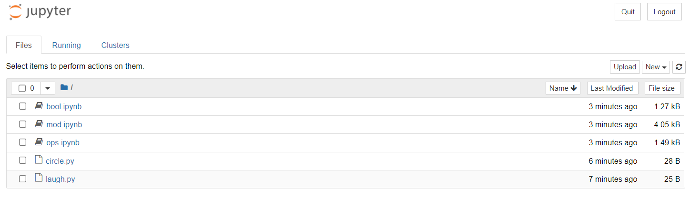

# Lab-P2: Python Modes and Programming

# WARNING: Unless you took a time portal to become my student in the past, this is not the correct repository :) Please go to the correct github repository for the current semester. If you are a Fall'21 semester student though, you are in the right place.

In the Wednesday lecture (Sep 15), we learned about three ways to run Python: 
interactive mode, script mode, and notebook "mode" (people outside of 220 won't
use that vocabulary for notebooks, hence the quotes). In this
lab, you'll practice those three modes. You'll also get practice
with operators, modular arithmetic and Boolean logic.

To get started, please create a `lab2` directory inside your
previously created course directory (named `cs220` or similar).  Then,
open a terminal and use `cd` to navigate to `lab2` (you may need to
review the steps from [lab-p1](https://github.com/msyamkumar/cs220-f21-projects/tree/main/lab-p1) 
to remember how to find the pathname of the `lab2` directory).

## The Three Modes

### Interactive Mode

Run `python --version` in the terminal.  You might see something like this:

```
Python 3.8.8
```

If it says something like 2.X.X, try running `python3 --version` instead.
If you need to run the latter, please use `python3` whenever we say `python`
in the directions this semester.

From the `lab2` directory, do the following.  Run `pwd` in the
terminal (this is a shell command in both bash, zsh, and PowerShell). 
Then type `python` and hit `ENTER`.

You should see something roughly like this (details will vary):

```
Python 3.8.8 (default, Apr 13 2021, 15:08:03) [MSC v.1916 64 bit (AMD64)] :: Anaconda, Inc. on win32
Type "help", "copyright", "credits" or "license" for more information.
>>>
```

Those `>>>` symbols are a Python prompt.  This means you can type
Python code, but your shell commands will not work until you exit
Python again.  To see this, try typing this Python code:
`print("hi")`, then hitting `ENTER`.  The message `hi` should be
printed.

Now try typing `pwd` again and hitting ENTER.  This should give you
the following error, because `pwd` is only valid in the shell (not
Python):

```
Traceback (most recent call last):
  File "<stdin>", line 1, in <module>
  NameError: name 'pwd' is not defined
```

Now let's try exiting Python and going back to the shell prompt.  On
Mac, you can do this with `CONTROL-D` (hold down the control key, then
press the D key at the same time).  On Windows, you can use `CONTROL-Z ENTER` 
(hold down the `CONTROL` key, then press the `Z` key at the same time; 
release both, then press the `ENTER` key). You can also exit 
interactive mode by typing in `exit()` and hitting `ENTER`.

Now that you've exited, try running both `pwd` and `print("hi")`
again.  This time, the former should work and that latter should fail
(because we're in the shell, and the former is a shell command whereas
the latter is Python code).

Re-enter interactive mode and try running a few Python expressions:

* `10 / 4`
* `10 // 4`
* `10 % 4`
* `not False`
* `not not True`
* `not not not True`
* `2 ** 1000000` (warning, this is a REALLY big number)
* `1/0` (should fail)
* `"ha" * 100`
* `"ha\n" * 100`
* `print("ha\n" * 100)`
* `print("ha\n\n" * 100)`

### Script Mode

From shell mode (make sure you've exited Python from before!), type
`idle laugh.py`.  This will normally open up a file named `laugh.py`
in the idle editor, but in this case it will create a new empty file
named `laugh.py` since one doesn't already exist.

If you are using MacOS, try the command `idle3 laugh.py`

**Warning**: If you are using MacOS and `idle3 laugh.py` command did
not work, then directly open IDLE from `Finder` 
and save the new file as `laugh.py`.

Paste the following
into the editor:

```python
print("ha " * 10 + "!")
```

From the run menu, click `Run Module` (saving your file if necessary);
or, you can accomplish the same by hitting `F5` on your keyboard.

Now close the shell window (where your program just ran and printed
"ha ha ..."), and remove the print in your file, so it looks like
this:

```python
"ha " * 10 + "!"
```

Run your code again (e.g., with `F5`).  Notice how it doesn't show
any of your output? In interactive mode, prints usually aren't
necessary, but they are in script mode.

Add back the print, then close any idle windows that are open.  Now
that you're back in the shell, run the following:

```
python laugh.py
```

Let's try to create a second program:

1. Run `idle circle.py` (`idle3 circle.py on MacOS)
2. Paste `print((8 / 2) ** 2 * 3.14)`
3. Run the program (either in idle with `F5`, or by exiting idle and running `python circle.py` in the shell)

The program computes the area of a circle.
*Can you figure out what the diameter of that circle is by reading the code?*

### Notebook Mode

You have already seen how to create a new notebook and turn it in.
Now, you'll get practice downloading and running existing notebooks.
For this part, download the `bool.ipynb`, `ops.ipynb`, and `mod.ipynb`
files to your `lab2` folder.

**IMPORTANT**: Use Google Chrome browser and the GitHub download
procedure we've shown you in [lab-p1](https://github.com/msyamkumar/cs220-f21-projects/tree/main/lab-p1#download-your-first-program)
involving right-clicking on the `Raw` button. Verify that your file is saved 
as a `.ipynb` file and not as a `.txt` file. If not, take a look at point 7 at
the Piazza [FAQ Page](https://piazza.com/class/ktaevwe7xx771?cid=9) to see
how to resolve the issue.

In the terminal (which should still have `lab2` as the current working
directory), run `jupyter notebook`.  You should see something like the
following:



You can now click on any of the three notebooks you've downloaded to
view the contents.  The first thing you'll want to do after opening it
is click `Kernel` > `Restart & Run All` so you can see the outputs.
The exercises you should do with each notebook are described below.

## Boolean Logic

Open and run the `bool.ipynb` notebook.  There will be six cells, with
outputs `True`, `False`, `False`, `True`, `False`, and `True`.  Take
moment to review each cell and think about why the output is either
`True` or `False`.  Review the lecture slides or ask your TA if any of
these are surprising to you.

There are different ways to get `True` or `False` in Python.  One way
is to directly type those words explicitly, as we already have.

The more common way is to use comparison operators to make claims that
are either True or False.  For example `1+1 == 2` is `True`, whereas
`-2 > 1` is `False`.

Your job is to edit the notebook and replace each `True` or `False` with a
Python expression (of your own choosing) that has the same truth
value.  For example, the last expression says `True or False`, so I
might edit that to instead be `1+1 == 2 or -2 > 1`.  You should get
creative, but try to use each of the following comparison examples at
least once: `==`, `!=`, `<`, `<=`, `>`, and `>=`.

After each change, rerun the cell and make sure that your modification
didn't change the result.  For example, that last cell was originally
`True`, and if we change the code to `1+1 == 2 or -2 > 1` and rerun, 
we should still get the same output.

## Order of Operations

Open and run the `ops.ipynb` notebook.  There will be six cells, each
containing a simple Python expression involving two operators.  Python
has operator-precedence rules to determine which of the two operators
to execute first.

Of course, the Python programmer (you!) can add parentheses to change
the order in which the operators are executed, thereby changing the
result.  Your job is to add parentheses in each case to get desired
result.  For example, in the first cell, `3 ** 4 - 1` evaluates to 80,
but you should change it to be `3 ** (4 - 1)`, thereby getting 27.

## Modular Arithmetic

What time does a clock show one hour after twelve o'clock?  Not 13
o'clock (that doesn't exist) -- instead, it wraps back around to 1
o'clock.  This is a weird kind of arithmetic, where adding doesn't
always make a number larger.

This alternative arithmetic is called **modular arithmetic**, and we
can use the modulo operator (`%`) in Python to perform modular
addition.  However, there's a twist with respect to the clock: in CS,
we count from 0, so if we were to have a **CS clock**, it would go
from 0 o'clock to 11 o'clock (instead of from 1 o'clock to 12
o'clock).

Open and run the `mod.ipynb` notebook.  You'll see many cells of the
form `X % 12`.  This computation is answering the question: *if we
start at 0 o'clock and wait `X` hours, what time is it?* The `% 12`
part means time wraps around at 12 o'clock, meaning that there is no
12 o'clock, just 0 o'clock again (remember we have a CS clock that
goes from 0 to 11 o'clock).

Try writing some expressions to answer the following questions
regarding a CS clock:

* What time will it be 6 hours after 9 o'clock? (run `(9 + 6) % 12` in a cell to find the answer, which is 3 o'clock)
* What time was 2 hours before 1 o'clock? (run `(1 - 2) % 12` in a cell to find the answer, which is 11 o'clock)
* What time was 4 hours before 2 o'clock?
* What will it be 12 hours after 6 o'clock?
* What will it be 13 hours after 6 o'clock?
* What will it be 24 hours after 6 o'clock?
* What will it be 25 hours after 6 o'clock?

You are now ready to take on [P2](https://github.com/msyamkumar/cs220-f21-projects/tree/main/p2)! Good luck!
