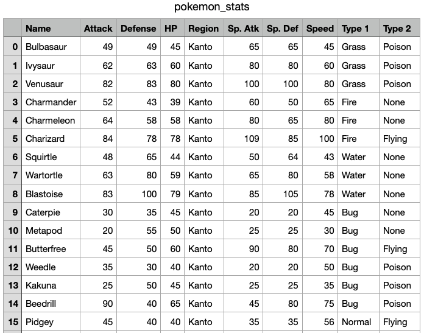

# Lab-P4: Conditional Statements and Pokémon API

In p4, you will be playing with some Pokémon and you will simulate simple Pokémon battles using conditional statements. In lab-p4, you will learn to use `project.py`, which you will need to complete p4. You will also be introduced to some simple conditional statements and 'helper functions' which will be useful for p4.

### Corrections/Clarifications

None yet

**Find any issues?** Report to us: 

- Brian Huang <thuang273@wisc.edu>
- Abhay Punjabi <apunjabi@wisc.edu>

## Learning the API

First click [`project.py`](https://github.com/msyamkumar/cs220-f21-projects/blob/main/lab-p4/project.py), [`pokemon_stats.csv`](https://github.com/msyamkumar/cs220-f21-projects/blob/main/lab-p4/pokemon_stats.csv), and [`type_effectiveness_stats.csv`](https://github.com/msyamkumar/cs220-f21-projects/blob/main/lab-p4/type_effectiveness_stats.csv) and download them to a `lab4` directory. If you found your `.csv` files are downloaded as `.txt` files (e.g. `pokemon_stats.txt` instead of `pokemon_stats.csv`), run `mv pokemon_stats.txt pokemon_stats.csv` from your Powershell/Terminal to change the type of the file into `.csv` file manually. Here `mv` is a shell command to rename or move files. All the data that we need for p4 is stored in `pokemon_stats.csv` and `type_effectiveness_stats.csv`. 

Open `pokemon_stats.csv` with Microsoft Excel or any other Spreadsheet software first, and take a look at it. You will see a list of Pokémon along with certain statistics for each of those Pokémon.



Each Pokémon comes from a certain 'Region', and has one or two 'Types'. A Pokémon with only one Type has 'None' as its value for 'Type 2'. Moreover, each Pokémon has six other statistics, namely:

1. Attack (short for Physical Attack)
2. Defense (short for Physical Defense)
3. HP (short for Hit Points)
4. Sp. Atk (short for Special Attack)
5. Sp. Def (short for Special Defense)
6. Speed (which is self explanatory)

Next, open `type_effectiveness_stats.csv` with Microsoft Excel or any other Spreadsheet software, and take a look at it. You will see a table of Pokémons' types representing the effectiveness of one type against another. The rows represent the type of the defender, and columns represent the type of attacker.


All Pokémon creatures and their moves are assigned certain types. Each type has several strengths and weaknesses against other Pokémon. In battle, you should use Pokémon and moves that have a type advantage over their opponent; doing so will cause much more damage than otherwise. There are 18 types in this table. Taking the second row (Fire) and the third column (Water) as an example, we see that Water type attack has an effeciveness of 2.0 against Fire type defense.

If you are feeling brave, take a look at [`gen_csv.ipynb`](https://github.com/msyamkumar/cs220-f21-projects/blob/main/lab-p4/gen_csv.ipynb) to see how these two files (`pokemon_stats.csv` and  `type_effectiveness_stats.csv`)  were generated. Don't worry if it doesn't make much sense at this point. By the end of CS220, you will be able to understand everything that is happening there. For now, you can try to figure out what is happening in each of the cells.

`project.py` is designed to give you access to the data in `pokemon_stats.csv` and `type_effectiveness_stats.csv`. First, we need to check the `project.py` API just like we did in [lab-p3](https://github.com/msyamkumar/cs220-f21-projects/tree/main/lab-p3). In lab-p3, we saw how to use `dir` and `.__doc__` to learn the API. This time, let us learn how to use the `help` function. To look at the entire `help` function output, keep pressing enter on your keyboard. Once you encounter `(END)`, you can press q to quit / exit. Enter the Python Interactive Mode and type:

```python
>>> import project
>>> help(project)
Help on module project:

NAME
    project

FUNCTIONS
    __init__()
        Automatically loads the data from 'pokemon_stats.csv' and 'type_effectiveness_stats.csv' when this module is imported.
    
    get_attack(pkmn)
        get_attack(pkmn) returns the Attack of the Pokémon with the name 'pkmn'
    
    get_defense(pkmn)
        get_defense(pkmn) returns the Defense of the Pokémon with the name 'pkmn'
    
    get_hp(pkmn)
        get_hp(pkmn) returns the HP of the Pokémon with the name 'pkmn'
    
    get_region(pkmn)
        get_region(pkmn) returns the region of the Pokémon with the name 'pkmn'
    
    get_sp_atk(pkmn)
        get_sp_atk(pkmn) returns the Special Attack of the Pokémon with the name 'pkmn'
    
    get_sp_def(pkmn)
        get_sp_def(pkmn) returns the Special Defense of the Pokémon with the name 'pkmn'
    
    get_speed(pkmn)
        get_speed(pkmn) returns the Speed of the Pokémon with the name 'pkmn'
    
    get_type1(pkmn)
        get_type1(pkmn) returns Type 1 of the Pokémon with the name 'pkmn'
    
    get_type2(pkmn)
        get_type2(pkmn) returns Type 2 of the Pokémon with the name 'pkmn'
    
    get_type_effectiveness(type1, type2)
        get_type_effectiveness(type1, type2) returns the effectiveness of type1 against type2
    
    print_stats(pkmn)
        print_stats(pkmn) prints all the statistics of the Pokémon with the name 'pkmn'

DATA
    __effectiveness__ = {'Bug': {'Bug': 1.0, 'Dark': 2.0, 'Dragon': 1.0, '...
    __pokemon__ = {'Abomasnow': {'Attack': 92, 'Defense': 75, 'HP': 90, 'N...

FILE
    c:\Users\ms\Documents\cs220\p4\project.py
```

As we can see, `help(project)` lists all the functions in the module `project.py` along with their docstrings.

As you can see, there are eleven functions here that do not begin with "two" underscores. Read the documentation or test them out to figure out what they do. 

You can find the documentation for any function by calling `help` on that function

```python
>>> help(project.print_stats)
```

If you want to see the function in action, try:
```python
>>> project.print_stats('Pikachu')
```

Similarly, experiment with the other ten functions inside `project.py`. Try the following:
1. `project.get_region('Squirtle')`
2. `project.get_type1('Pikachu')`
3. `project.get_type2('Bulbasaur')`
4. `project.get_hp('Dragonite')`
5. `project.get_attack('Charizard')`
6. `project.get_defense('Snorlax')`
7. `project.get_sp_atk('Infernape')`
8. `project.get_sp_def('Squirtle')`
9. `project.get_speed('Greninja')`
10. `project.get_type_effectiveness('Fire', 'Grass')`

Once you are comfortable with the functions in `project.py` move to the next section.

## Introducing Conditional Statements

Create a new notebook inside the `lab4` directory and run the following code in a cell. When we say "notebook" we are referring to creating a new python3 jupyter notebook similar to previous labs/projects. A reminder of how to create a new one is shown below:


```python
import project

if project.get_region('Pikachu') == 'Kanto':
    print ('Kanto is the correct region')
else:
    print ('Kanto is not the correct region.')
```

What is the output of this cell? If you change the name of the Pokémon from 'Pikachu' to 'Greninja', does the output change? What happens if you use a bad name (say 'CS220')?

In a new cell, run the following code:

```python
if project.get_hp('Snorlax') >= project.get_hp('Heracross'):
    print('Snorlax')
else:
    print('Heracross')
```

As you might expect, the above code checks the HP of both the Pokémon and prints the name of the Pokémon with the higher HP. In p4, you will regularly have to compare the stats of different Pokémon. So, it might be useful to create a function here. First, copy/paste the following code in a new cell.

```python
def compare_hp(pkmn1, pkmn2):
    if project.get_hp(???) >= project.get_hp(???):
        return ???
    else:
        return ???
```

You will have to replace the `???` with the appropriate variables. Such a function that performs a small task and can be used by other functions to perform more complicated tasks is called a 'helper function'. We will be creating a lot more helper functions in p4. Make sure to test each helper function by invoking the function. In the meantime, try this on your own:

```python
def compare_attack(pkmn1, pkmn2):
    #TODO: Return the name of the Pokemon with the higher Attack stat
```

Please find the function which is used to get the attack of a Pokémon provided in `project.py`. Fill in the details of the function `compare_attack`. If you want, you can make more such helper functions.

## More Advanced Conditional Statements

So far, we have only used if statements to compare two numbers. Let us do something more fancy now. As you might have seen in the `type_effectiveness_stats.csv` file, a Pokémon might have one or more types., a Pokémon might have one or more types. For instance, Pikachu has just one type: Electric, whereas Charizard has two: Fire and Flying. Copy/paste the following code in a new cell.

```python
def get_num_types(pkmn):
    if project.get_type1(pkmn) == 'None':
        return 0
    elif project.get_type2(pkmn) == 'None':
        return 1
    else:
        return 2
```

Test the function by calling it with different Pokemon to understand what it is doing. Finally, let us create a function that checks if two Pokémon have the same types:

```python
def same_types(pkmn1, pkmn2):
    if project.get_type1(pkmn1) == project.get_type1(pkmn2):
        if project.get_type2(pkmn1) == project.get_type2(pkmn2):
            return True
    return False
```
So far, the function looks good, but there is something wrong with it. To see the problem, look at the output of the following cell:

```python
same_types('Dragonite', 'Noivern')
```

Look at the output of `project.print_stats('Dragonite')` and `project.print_stats('Noivern')` to see why it went wrong. Pokémon with the same types but in different orders should also be considered the same type. We can add some code to account for this as shown below:

```python
def same_types(pkmn1, pkmn2):
    if project.get_type1(pkmn1) == project.get_type1(pkmn2):
        if project.get_type2(pkmn1) == project.get_type2(pkmn2):
            return True

    elif project.get_type1(???) == project.get_type2(???):
        if project.get_type2(???) == project.get_type1(???):
            return True
            
    return False
```

Replace the `???` with appropriate variables.

Finally, let us take a look at type effectiveness. In p4, you will have to compare the strengths of different types against each other. The `get_type_effectiveness` function in `project.py` will be useful for us here. Given two types `type1` and `type2`, we can use that function to find the effectiveness of `type1` against `type2`, and also, the effectiveness of `type2` against `type1`. So, we can compare the effectiveness of the two types against each other, to determine which is stronger. Try to replace the `???` in the following function:

```python
def stronger_type(type1, type2):
    type_1_effectiveness = project.get_type_effectiveness(???, ???)
    type_2_effectiveness = ???
    if type_1_effectiveness > type_2_effectiveness:
        return type1 + " is stronger than " + type2
    elif ???:
        return type2 + " is stronger than " + type1
    else:
        return type1 + " and " + type2 + " are equally strong"
```

## Good Coding Style for Functions
When we are trying to design a function, we want to make sure that only the latest version for that function exists in our code. For example, in the previous section, we introduced an initial version of `same_types(pkmn1, pkmn2)`, where the conditional expressions needed some modifications. Do not duplicate the original function. Instead, modify the original directly and rerun the cell to update the definition. This way, there won't be multiple `same_types(pkmn1, pkmn2)` functions and that makes it easier to maintain your code.

You can now get started with [p4](https://github.com/msyamkumar/cs220-f21-projects/tree/main/p4). You can use any helper function that you have created here in the project. Good luck and have fun!
