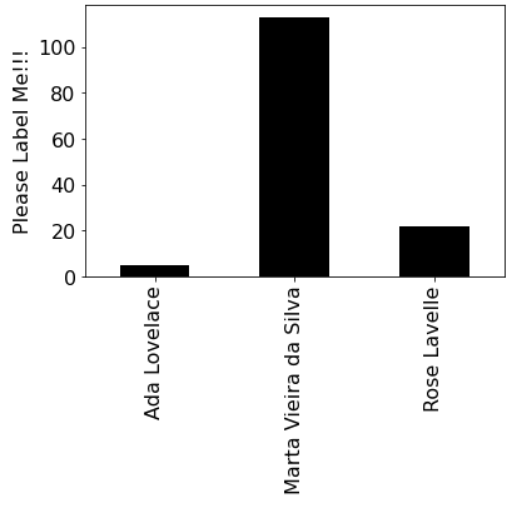
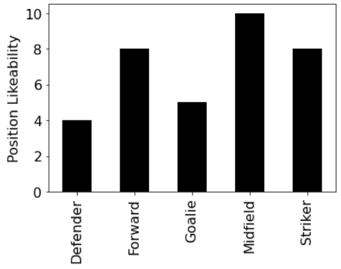

# Lab-P9: Plotting, and Sorting

In this lab, you'll learn to create simple plots, decode a secret
message, and take your sorting to the next level.  Have fun!

## New packages

For this lab, you'll need to use two new packages: `matplotlib` and
`pandas`.  We'll eventually learn a lot about these, but for now you
just need to call some functions we provide.

**Note:** if you installed Anaconda** as recommended 
at the beginning of this class, these modules must have already been installed on your laptop. 
However, if you did not follow those instructions, you will need to install
these packages now. [Go to Package Installation (Optional) section](#package-installation).


## Plotting Dictionaries

Creating a dictionary will often be the first step towards creating a
bar plot in Python. In particular, each dictionary key might
correspond to a category (along the x-axis), and each value might
correspond to an amount (along the y-axis). To setup plotting in
Python, paste following into two separate cells (with no other code
added):

```python
%matplotlib inline # Allows you to render plots in the same jupyter notebook
```

And in a second cell:

```python
import matplotlib, pandas

def plot_dict(d, label="Please Label Me!!!"):
    ax = pandas.Series(d).sort_index().plot.bar(color="black", fontsize=16)
    ax.set_ylabel(label, fontsize=16)
```

Let's try creating a simple dictionary and using it to create a bar plot with the `plot_dict` function:

```python
goals = {"Ada Lovelace": 5, "Rose Lavelle": 22, "Marta Vieira da Silva": 113}
plot_dict(goals)
```

You should see something like the following:



Notice that the y-axis is missing a label; that can be specified with
an optional second argument.  Try specifying something descriptive,
like this, and observe the result:

```python
goals = {"Ada Lovelace": 5, "Rose Lavelle": 22, "Marta Vieira da Silva": 113}
plot_dict(goals, "number of goals")
```

Now try writing a couple lines of code to produce a plot using
`plot_dict` that looks roughly like the following (feel free to use
different numbers to reflect your personal preferences):



## Creating a Dictionary with Custom Keys

Do you recall in p5 that we organized hurricanes by decade?  
We are going to use that same idea to create custom keys for a dictionary of frequencies.

First, we are going to write a function that is given a year and returns a string that
represents the decade the year belongs to.  The function will be called year_to_decade. 
Here are some sample calls and the expected output:

year_to_decade(2003) will return '2001 to 2010'
year_to_decade(2000) will return '1991 to 2000'
year_to_decade(2011) will return '2011 to 2020'

In a new cell, paste this code which starts the function and then tests it
within a for loop:

```python
def year_to_decade(year):
    if year % 10 == 0:
        return str(year-9) + " to " # complete this line
    else:
        return str(year - year % 10 + 1) + " to " # complete this line

print("year", "decade", sep="\t")
for year in range(1999, 2012):
    print(year, year_to_decade(year), sep="\t")
```

Your output should be the following:
```python
year	decade
1999	1991 to 2000
2000	1991 to 2000
2001	2001 to 2010
2002	2001 to 2010
2003	2001 to 2010
2004	2001 to 2010
2005	2001 to 2010
2006	2001 to 2010
2007	2001 to 2010
2008	2001 to 2010
2009	2001 to 2010
2010	2001 to 2010
2011	2011 to 2020
```

Now that we can make a decade string for any year, let's use this to make a dictionary.

Paste this code into a new cell and complete the code to create a dictionary.
```python
# given a list of years, make a dict of frequency per decade
years = [1997, 1995, 2013, 2014, 2006, 2006, 2004, 2019, 1999, 2000, 2010]

decade_dict = {} # the key is the decade, the value is the frequency
for year in years:
    decade = year_to_decade(year)
    # write your code here
    
decade_dict
```

Your dictionary should be the following:
```python
{'1991 to 1999': 3,
 '2011 to 2019': 3,
 '2001 to 2009': 3,
 '1991 to 2000': 1,
 '2001 to 2010': 1}
```

## Sorting a Dictionary

One way to sort a dictionary is to convert into list of tuples, sort the tuples,
and then convert the sorted tuples back to a dictionary.  

Try this example in a new cell:

```python
dict(sorted(decade_dict.items()))
```

The tuples were sorted by their first item, which was the key. 

If you want to sort by values, use a keyword argument to identify a function reference. 
In lecture we learned how to do this with a lambda function:

```python
dict(sorted(decade_dict.items(), key=lambda d:d[1]))
```
Refer to your Nov 01 lecture notes for more explanation of how lambda functions work. 


## Sorting a List of Dictionaries by any category

When we have a list of dictionaries, we can sort the list by any dictionary category. 
Given this list of dictionaries,

```python
players = [{'first': 'Ada',
  'last': 'Lovelace',
  'country': 'England',
  'positions': ['Defender', 'Goalie', 'Midfield'],
  'jersey': 12,
  'goals': 5},
 {'first': 'Rose',
  'last': 'Lavelle',
  'country': 'USA',
  'positions': ['Midfield'],
  'jersey': 16,
  'goals': 22},
 {'first': 'Marta',
  'last': 'Vieira da Silva',
  'country': 'Brazil',
  'positions': ['Midfield', 'Forward'],
  'jersey': 10,
  'goals': 113},
{'first': 'Ada',
    'last': 'Hegerberg',
    'country': 'Norway',
    'positions': ['Forward', 'Striker'],
    'jersey': 14,
    'goals': 38}]
```
We can sort them by any dictionary key. 
Here, we sort by jersey:

```python
player_dicts_by_jersey = sorted(players, key=lambda p:p['jersey'])
player_dicts_by_jersey
```

Change the 'None' in the code below to sort by 'goals' , reversed.
```python
player_dicts_by_goals = None
player_dicts_by_goals
```

## Bucketizing Players

You have learned in previous lectures how to bucketize data, which makes a dictionary of lists. 
Let's try this with players.  In particular, let's make a bucketized dictionary of players
by position.  The dictionary will look like this:

```python
{'Defender': [{'first': 'Ada',
   'last': 'Lovelace',
   'country': 'England',
   'positions': ['Defender', 'Goalie', 'Midfield'],
   'jersey': 12,
   'goals': 5}],
 'Goalie': [{'first': 'Ada',
   'last': 'Lovelace',
   'country': 'England',
   'positions': ['Defender', 'Goalie', 'Midfield'],
   'jersey': 12,
   'goals': 5}],
 'Midfield': [{'first': 'Ada',
   'last': 'Lovelace',
   'country': 'England',
   'positions': ['Defender', 'Goalie', 'Midfield'],
   'jersey': 12,
   'goals': 5},
  {'first': 'Rose',
   'last': 'Lavelle',
   'country': 'USA',
   'positions': ['Midfield'],
   'jersey': 16,
   'goals': 22},
  {'first': 'Marta',
   'last': 'Vieira da Silva',
   'country': 'Brazil',
   'positions': ['Midfield', 'Forward'],
   'jersey': 10,
   'goals': 113}],
 'Forward': [{'first': 'Marta',
   'last': 'Vieira da Silva',
   'country': 'Brazil',
   'positions': ['Midfield', 'Forward'],
   'jersey': 10,
   'goals': 113},
  {'first': 'Ada',
   'last': 'Hegerberg',
   'country': 'Norway',
   'positions': ['Forward', 'Striker'],
   'jersey': 14,
   'goals': 38}],
 'Striker': [{'first': 'Ada',
   'last': 'Hegerberg',
   'country': 'Norway',
   'positions': ['Forward', 'Striker'],
   'jersey': 14,
   'goals': 38}]}
```

Notice that some players appear in more than one bucket!  
That's because some players play more than one positon.  
In our code, we will need to iterate through all positions and place the same player
in each position bucket. 

Complete this code to make the buckets:
```python
buckets = {}
for player in players:
    position_list = player['positions']
    for position in position_list:
        # make an empty list if this position is not in the dictionary
        # add this player to this bucket
buckets  
```

## Comprehensions

In the Nov 03 lecture you will learn about comprehensions.  
We can write comprehensions on dictionaries to form lists or to form new dictionaries.
Let's look at the following dictionary of heart rates samples:
```python
heart_rates = {"Andy": [67, 59, 84, 88],
         "Meena": [59, 73, 67, 80, 79],
         "Peyman": [67, 84, 71, 68 , 70]}
```

We would like to report the median heart rate for each person.  
First, complete this median function, and be sure the test code runs correctly.

```python
def median(items):
    items.sort() 
    if len(items) % 2 == 1:
        return 0 #change this
    else:
        firstMiddle = items[(len(items) // 2) - 1]
        secondMiddle = items[len(items) // 2]
        median = 0
        return median #change this
    
print(median([44, 40, 45, 38, 42]))
print(median([17, 18, 20, 19]))
```
Now that you have the median function working, let's see how to 
quickly make a list by iterating through a dictionary. 

Paste the following code into a new cell and run it:

```python
# make a list of just the medians using list comprehension
med_list = [median(v) for (k,v) in heart_rates.items()]
med_list
```
The [] tells Python that we want to make a list
heart_rates.items() is a list of tuples made from the key/value pairs
the for (k,v) tells Python to iterate through teach tuple,  
call the first item k, and call the 2nd item v

The median(v) tells Python to fill the list with the result of a call to median on v


Another way to make a comprehension is to make a dictionary.  Given the dictionary
heart_rates, let's make a new dictionary that looks like this:

```python
{'Andy': 75.5, 'Meena': 73, 'Peyman': 70}
```

The keys are the same as in heart_rates but the value associated with each key is the median.

This will be very similar to the list comprehension, 
but we need to use slightly different syntax to make a dictionary.
Try out this code in a new cell. 

```python
med_hr_dict = {k:median(v) for (k,v) in heart_rates.items()}
med_hr_dict
```

Try out these other comprehensions. Each can be done in one line of code.

1. Make a list of all countries in players
2. Make a dictionary of position, number of players at this position
3. Make a dictionary of first, goals and order it by goals


## Project Hints

* You'll be creating a few plots for p9, so consider copying the `plot_dict` function
* You'll need to answer a few questions such as "Which actors are featured in the most movies?" The easiest way to approach such questions is with a custom sort with a lambda function.
* You are allowed to use comphrehensions when building lists or dictionaries.

Good luck!

## Package Installation

**Note:** if you were able to successfully import `matplotlib` and `pandas` modules, you can **skip this optional section**

`matplotlib`, `pandas` and many other Python packages are available on 
the [PyPI site](https://pypi.org/). 
`pip install` takes care of the details of going to PyPI and installing these 
packages for you.

Once you know the name of a Python package, installing it is easy.  You just
run the following in the terminal, substituting in the package name:

```
pip install ????
```

So in this case, you should run the following (in either the Mac
Terminal or Windows PowerShell):

```
pip install matplotlib
pip install pandas
```

You may see "Requirement already satisfied" messages (e.g., if you
already installed these by following the setup videos we provided at
the beginning of the semester), so don't be surprised if your output
looks something like this:

```
Requirement already satisfied: pandas in c:\users\ms\anaconda3\lib\site-packages (1.2.4)
Requirement already satisfied: pytz>=2017.3 in c:\users\ms\anaconda3\lib\site-packages (from pandas) (2021.1)
Requirement already satisfied: python-dateutil>=2.7.3 in c:\users\ms\anaconda3\lib\site-packages (from pandas) (2.8.1)
Requirement already satisfied: numpy>=1.16.5 in c:\users\ms\anaconda3\lib\site-packages (from pandas) (1.20.1)
Requirement already satisfied: six>=1.5 in c:\users\ms\anaconda3\lib\site-packages (from python-dateutil>=2.7.3->pandas) (1.15.0)
```

Common issues:
* If you have both Python 2 and 3 installed, you may need to replace `pip` with `pip3`.
* If neither pip command is found, you may need to replace `pip` with `python -m pip` or `python3 -m pip`.  This just means pip, although installed, is not on the PATH (i.e., your computer doesn't know where to find it).
* If you run into any other error post a screenshot of the error on Piazza.

