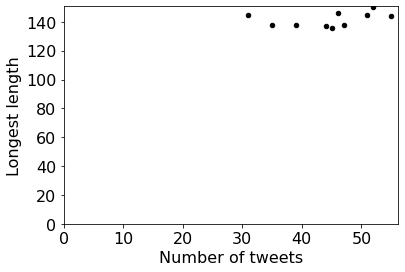
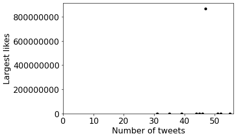
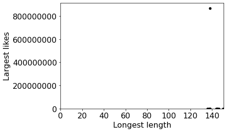
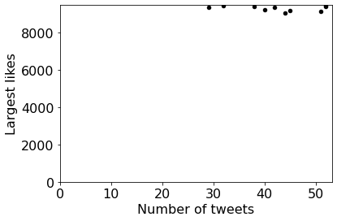

# Project 11: Twitter, Stage 2


## Clarifications/Corrections

None yet.

**Find any issues?** Report to us:  

- Saurabh Kulkarni <skulkarni27@wisc.edu>
- Hardik Chauhan <hchauhan2@wisc.edu>
- Dyah Adila <adila@wisc.edu>

## Learning Objectives

In this project, you will demonstrate your ability to:

- Use dictionaries to organize information
- Handle file errors
- Use namedtuples
- Make scatter plots using pandas
- Write a recursive function

## Coding Style Requirements

Remember that coding style matters! **We might deduct points for bad coding style.** Here are a list of coding style requirements:

- Do not use meaningless names for variables or functions (e.g. uuu = "my name").
- Do not write the exact same code in multiple places. Instead, wrap this code into a function and call that function whenever the code should be used.
- Do not call unnecessary functions.  Instead, save the results from previous function calls.
- Avoid using slow functions multiple times within a loop.
- Avoid inappropriate use of data structures.
- Don't name the variables and functions as python keywords or built-in functions. Bad example: str = "23".
- Don't define multiple functions with the same name or define multiple versions of one function with different names. Just keep the best version.
- Put all import commands together in the second cell of main.ipynb, the first cell should be submission information (netid and etc). No extra import statements!
- Don't use absolute paths such as `C://ms//CS220//p11`. **You may only use relative paths**. When we test your work on a different operating system, all of the tests will fail and you will get a 0. If you turn in a version that causes an error in the autograder due to absolute paths, you may fix the error and resubmit the assignment. However, **we will impose a 5% penalty**.

## Setup

**Step 1:** Download [`tweets.zip`](https://github.com/msyamkumar/cs220-f21-projects/blob/main/p11/tweets.zip) and [`recursive.zip`](https://github.com/msyamkumar/cs220-f21-projects/blob/main/p11/recursive.zip) and extract them to a directory on your computer (using [Mac directions](http://osxdaily.com/2017/11/05/how-open-zip-file-mac/) or [Windows directions](https://support.microsoft.com/en-us/help/4028088/windows-zip-and-unzip-files)). After extracting, you will find the following directories - `full_data`, `play`, `sample_data` and `recursive`.

**Step 2:** Download [`test.py`](https://github.com/msyamkumar/cs220-f21-projects/blob/main/p11/test.py) to the directory from step 1 (`test.py` should be in the same directory as all of the directories needed in this assignment)

**Step 3:** Create a `main.ipynb` in the same location, as the above files.

## **Notes**:

 **Make sure `full_data`, `sample_data`, `play`, `recursive`, `main.ipynb` and `test.py` are in same directory**. `test.py` will also now check to see if the files are in the correct directories. So, you can verify with it.

**Make sure your answers ignore files that begins with a "." . This is especially important on a Mac which might create a file called .DS_Store. You are expected to explicitly check and disregard files beginning with a "." in your answers.**


## Introduction

In this project, you'll be analyzing the clean data from p10. 

* Some files will be CSVs, others JSONs
* Data is spread across multiple files and multiple levels of sub directories
* Some integer values may be represented as strings with a suffix of "M", "K", or similar

Note that unlike p10, the .csv and .json files in this assignment have been cleaned and do not have any errors.

Please feel free to copy and re-use your functions from p10. But the files you uncompressed in Setup (`tweets.zip` and `recursive.zip`) are slightly different from the ones you used in p10. Currently, there are more redundant files (eg. files with extension `.info`) or more corner cases you should handle in your code. Please make sure your code from p10 can work well in p11. Lastly, since you are only allowed to submit a single jupyter notebook, please **do not** directly `import` your functions from p10 but copy them from p10 instead.

For this project, you'll create a new `main.ipynb` and answer questions in the usual format. **Please go through the [lab-p11](https://github.com/msyamkumar/cs220-f21-projects/tree/main/lab-p11) before working on this project.** The lab introduces some useful techniques (e.g., making scatter plots, writing recursive functions) related to this project. So please be sure to complete all of lab-p11 before starting this project.

## Questions

Until question 13, everything is about the data in `full_data`. Use your code from p10 to answer the questions (this means you'll ignore corrupt data). 

For questions where you need to make scatter plots, **do not** simply copy the dictionaries provided below the plots. Instead, use them to verify with the dictionaries you created. For these questions (Q6, Q7, Q8, Q12 and Q13), we will manually verify the correctness of the code you wrote and the plots you created.

Finally, as a reminder, you should bin/bucketize the data by creating dictionaries to group similar items wherever neccessary (hint: you did this in [lab-p9](https://github.com/msyamkumar/cs220-f21-projects/tree/main/lab-p11)). For example, in question 3, you may bucketize the tweets by their usernames. Using this approach will strengthen your understanding of dictionaries and allows you to solve the questions using minimal lines of code.

### #Q1: How many unique tweet lengths are present in the dataset?

### #Q2: Which usernames appear in the dataset?

Answer in the form of a `list`.

### #Q3: How **prolific** is each user?

Answer with a `dict` that maps username to the number of tweets by that user.

### #Q4: What is the length of the longest tweet for each user?

Answer with a `dict` that maps username to the length of that tweet.

### #Q5: What is the largest number of likes received on a tweet for each user?

Answer with a `dict` that maps username to the largest number of likes by that user. Make sure all values in this `dict` are integers.

### #Q6: What is the relationship between the number of tweets by a user and the length of their longest tweet?

Answer with a scatter plot showing 10 points (one per user). The x-axis represents the number of tweets, and the y-axis represents the length. It should look like this:



The dictionaries you will need to plot are:

Dictionary representing number of tweets per user:
```python
{'USERID_1': 52,
 'USERID_7': 55,
 'USERID_10': 45,
 'USERID_9': 44,
 'USERID_4': 35,
 'USERID_6': 51,
 'USERID_3': 39,
 'USERID_2': 47,
 'USERID_5': 46,
 'USERID_8': 31}
```
Dictionary representing longest tweets per user:
 ```python
 {'USERID_1': 150,
 'USERID_7': 144,
 'USERID_10': 136,
 'USERID_9': 137,
 'USERID_4': 138,
 'USERID_6': 145,
 'USERID_3': 138,
 'USERID_2': 138,
 'USERID_5': 146,
 'USERID_8': 145}
 ```

Hint: you can directly put your `dict` into the scatter function from lab-p11. The dictionary we put here is for you to check whether the data of your graph is correct. **Don't simply copy the dictionary we provide to your notebook!**

Make sure to label the vertical axis with an informative name for all your graphs!

### #Q7: What is the relationship between the number of tweets and the largest number of likes?

Answer with a scatter plot showing 10 points (one per user). The x-axis represents the number of tweets, and the y-axis represents the largest number of likes. It should look like this:



The dictionaries you will need to plot are:

Dictionary representing number of tweets per user:
```python
{'USERID_1': 52,
 'USERID_7': 55,
 'USERID_10': 45,
 'USERID_9': 44,
 'USERID_4': 35,
 'USERID_6': 51,
 'USERID_3': 39,
 'USERID_2': 47,
 'USERID_5': 46,
 'USERID_8': 31}
```
Dictionary representing largest number of likes per user:
 ```python
{'USERID_1': 9393,
 'USERID_7': 9851,
 'USERID_10': 9936,
 'USERID_9': 9728,
 'USERID_4': 9618,
 'USERID_6': 9149,
 'USERID_3': 9678,
 'USERID_2': 869000000,
 'USERID_5': 9608,
 'USERID_8': 915000}
 ```

### #Q8: What is the relationship between the length of their longest tweet and the largest number of likes?

Answer with a scatter plot showing 10 points (one per user). The x-axis represents the length, and the y-axis represents the largest number of likes. It should look like this:



You can refer to the dictionaries we provided in questions 6 and 7 to verify with your dictionaries that you need to plot for this question.
<!--
The dictionaries you will need to plot are:

Dictionary representing longest tweets per user:
```python
 {'USERID_1': 150,
 'USERID_7': 144,
 'USERID_10': 136,
 'USERID_9': 137,
 'USERID_4': 138,
 'USERID_6': 145,
 'USERID_3': 138,
 'USERID_2': 138,
 'USERID_5': 146,
 'USERID_8': 145}
```
Dictionary representing largest number of likes per user:
 ```python
{'USERID_1': 9393,
 'USERID_7': 9851,
 'USERID_10': 9936,
 'USERID_9': 9728,
 'USERID_4': 9618,
 'USERID_6': 9149,
 'USERID_3': 9678,
 'USERID_2': 869000000,
 'USERID_5': 9608,
 'USERID_8': 915000}
 ```
-->
### #Q9: What is the username of the user represented by the outlier in the last two plots?

In [statistics](https://en.wikipedia.org/wiki/Statistics), an **[outlier](https://en.wikipedia.org/wiki/Outlier)** is a [data point](https://en.wikipedia.org/wiki/Data_point) that differs significantly from other observations. To solve this question, you do not need to write any mathematical algorithm, just use `sorted()` to find the outlier. **Note that you are not allowed to hardcode the index of the outlier.**

### #Q10: What are the tweets made by that outlier user?

Answer with a list of Tweet objects, sorted by num_liked in descending order. We will be looking at your code, so do not hardcode the solution. We will deduct points for hardcoding.

The first 5 tweets of the expected output are:

```python
[Tweet(tweet_id='1467894593', username='USERID_2', num_liked=869000000, length=136),
 Tweet(tweet_id='1467875163', username='USERID_2', num_liked=9891, length=69),
 Tweet(tweet_id='1467862806', username='USERID_2', num_liked=9465, length=68),
 Tweet(tweet_id='1467907751', username='USERID_2', num_liked=9048, length=110),
 Tweet(tweet_id='1467928764', username='USERID_2', num_liked=9026, length=41)]
```

### #Q11: After excluding the outlier tweet of this outlier user (found in q10), what is the average of the remaining num_liked values for this user?
Make sure to round off your solution to 2 decimal places.

----

Hint: Try creating a common function which can be used to solve both questions 12 and 13.

### #Q12: If we exclude the top 3 most-liked tweets (among all tweets), what is the relationship between the number of tweets and the largest number of likes?

Answer with a scatter plot showing 10 points (one per user). The x-axis represents the number of tweets, and the y-axis represents the largest number of likes. It should look like this:


The dictionaries you will need to plot are:

Dictionary representing number of tweets per user (after excluding top 3 most-liked tweets):
```python
{'USERID_2': 46,
 'USERID_7': 55,
 'USERID_10': 44,
 'USERID_9': 44,
 'USERID_3': 39,
 'USERID_4': 35,
 'USERID_5': 46,
 'USERID_8': 30,
 'USERID_1': 52,
 'USERID_6': 51}
```
Dictionary representing largest number of likes per user (after excluding top 3 most-liked tweets):
 ```python
{'USERID_2': 9891,
 'USERID_7': 9851,
 'USERID_10': 9822,
 'USERID_9': 9728,
 'USERID_3': 9678,
 'USERID_4': 9618,
 'USERID_5': 9608,
 'USERID_8': 9462,
 'USERID_1': 9393,
 'USERID_6': 9149}
 ```

### #Q13: If we exclude the 20 most-liked tweets (among all tweets), what is the relationship between the number of tweets and the largest number of likes?

Answer with a scatter plot showing 10 points (one per user). The x-axis represents the number of tweets, and the y-axis represents the largest number of likes. It should look like this:



The dictionaries you will need to plot are:

Dictionary representing number of tweets per user (after excluding top 20 most-liked tweets):
```python
{'USERID_4': 32,
 'USERID_7': 52,
 'USERID_3': 38,
 'USERID_1': 52,
 'USERID_10': 42,
 'USERID_8': 29,
 'USERID_9': 40,
 'USERID_5': 45,
 'USERID_6': 51,
 'USERID_2': 44}
```
Dictionary representing largest number of likes per user (after excluding top 20 most-liked tweets):
 ```python
{'USERID_4': 9459,
 'USERID_7': 9449,
 'USERID_3': 9407,
 'USERID_1': 9393,
 'USERID_10': 9361,
 'USERID_8': 9343,
 'USERID_9': 9222,
 'USERID_5': 9188,
 'USERID_6': 9149,
 'USERID_2': 9048}
 ```

----

You will need to write a recursive function to answer Q14 - Q20.  Before you read further, be sure that you have completed and reviewed the recursive function examples in lab-p11.

The recursive function you are going to write takes a directory path as a parameter, **recursively** explores that directory for any files (which might be
buried in many levels of sub directories), and finally returns a list
of paths to files inside that directory. Remember, when we mean recursively explores that directory, your code should get each file without having to explicitly hardcode the names of the files.  **Note that the output paths should be sorted
in alphabetical order (hint: add a sorted() before returning the list of paths) and exclude any files or directories with names beginning with `.`** 

An example answer will have the form of:

```python
['play/rb/rb9/12.xls', 'play/rb/rb9/89.csv']
```

There are Python functions that can do this for you
but we expect you to write this function for yourself. If you use
one of these existing implementations, we'll **deduct any points** you
get for the remaining questions.

Your function MAY use the following:
* `os.listdir`
* `os.path.join`
* `os.path.isfile`
* `os.path.isdir`

The appearance of your results may differ a little bit depending on your operating system. (e.g., `'play\\rb\\rb9\\12.xls'` for Windows users, `'play/rb/rb9/12.xls'` for MacOS user). To this end, make sure you use **os.path.join** to take care of these operating system differences, instead of hardcoding the path. 

----

### #Q14: What are the files in the `rb` directory of `play` directory?

Answer this question with a list of relative path.

### #Q15: What are the files in the `qwe` directory of `ls` directory of the `play` directory?

Answer this question with a list of relative path.

### #Q16: What are the files in the `play` directory?

Answer this question with a list of relative path.

### #Q17: What are the files in the `others` directory of the `recursive` directory?

Answer this question with a list of relative path.

### #Q18: What are the files in the `recursive` directory?

Answer this question with a list of relative path.

### #Q19: How many tweets are in the files in the `USERID_4` directory of the `recursive` directory?

Answer this question with an integer. There might be different file types (e.g., `.json` and `.csv`) which should be handled by your code. We will be looking at your code, so do not hardcode the solution. We will deduct points for hardcoding.

### #Q20: How many tweets are in the files in the `recursive` directory?

Answer this question with an integer. There might be different file types (e.g., `.json` and `.csv`) which should be handled by your code. We will be looking at your code, so do not hardcode the solution. We will deduct points for hardcoding.

### Before turning in:
Be sure to run test.py and make sure there are no errors. If you turn in a version of your code which fails on test.py (i.e. you can't see which questions you got right or not), **we will deduct 5 points**. If the autograder is failing but you still want to turn in, you can see which question it is failing on and comment out the code for that question, essentially leaving it out. 

After you add your name and the name of your partner to the notebook, please remember to **Kernel->Restart and Run All** to check for errors then run the test.py script one more time before submission.  To keep your code concise, please **remove your own testing code that does not influence the correctness of answers.** 
