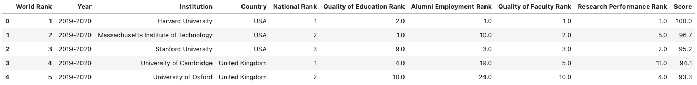
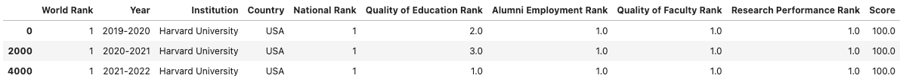
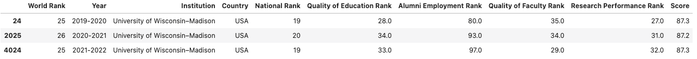
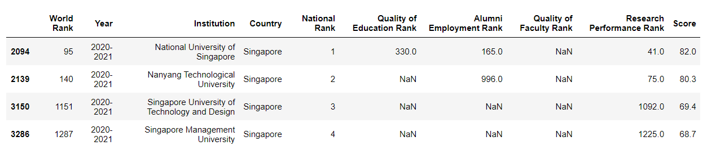
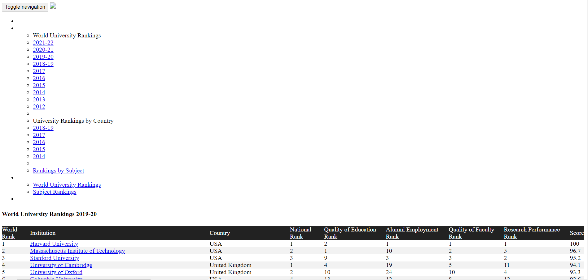

# Project 12: World University Rankings

## Clarifications/Corrections

None yet.

**Find any issues?** Report to us: 

- Brian Huang <thuang273@wisc.edu>
- Yelun Bao <ybao35@wisc.edu>
- Soumya Suvra Ghosal <sghosal2@wisc.edu>

## Learning Objectives

In this project, you will demonstrate your ability to:

- Read and write files
- Use a linter with your code
- Create and use Pandas DataFrames
- Use BeautifulSoup to parse web pages

## Coding Style Requirements

Remember that coding style matters! **We might deduct points for bad coding style.** Here are a list of coding style requirements:

- Do not use meaningless names for variables or functions (e.g. uuu = "my name").
- Do not write the exact same code in multiple places. 
- Do not call unnecessary functions.
- Avoid calling slow functions multiple times within a loop.
- Avoid inappropriate use of data structures. For instance: do not use `for` loop to search for a corresponding value in a dictionary with a given key; instead use `dictname[key]` directly.
- Do not name variables or functions as python keywords or built-in functions. Bad example: str = "23".
- Do not define multiple functions with the same name or define multiple versions of one function with different names. Just keep the best version.
- Put all `import` commands together at the second cell of `main.ipynb`, the first cell should be submission information (netid and etc).
- Do not use absolute paths such as `C://ms//cs220//p12`. **You may only use relative paths**. When we test your work on a different operating system, all of the tests will fail and you will get a 0. Don't panic when you see this, please fix the error and resubmit your assignment. Contact your TA if you need assistance with this task.
- **Avoid using loops to iterate over pandas dataframes and instead use boolean expressions**. More details are in the hints.

## Overview

For this project, you're going to analyze the world university rankings!

Specifically, you're going to use Pandas to analyze various statistics of the top ranked universities across the world, over the last three years.

To start, download [`test.py`](https://github.com/msyamkumar/cs220-f21-projects/blob/main/p12/test.py) and [`expected.html`](https://github.com/msyamkumar/cs220-f21-projects/blob/main/p12/expected.html).  You'll also need to
download [`lint.py`](https://github.com/msyamkumar/cs220-f21-projects/blob/main/p12/lint.py) (see linter documentation under "Testing" below). You'll do all your work in `main.ipynb`.

**Warning:** Do not download any of the other files manually (you must write Python code to
download these automatically, as in lab-p12). When we run the autograder, the other files such as [`rankings.json`](https://github.com/msyamkumar/cs220-f21-projects/blob/main/p12/rankings.json), [`2019-2020.html`](https://github.com/msyamkumar/cs220-f21-projects/blob/main/p12/2019-2020.html), [`2020-2021.html`](https://github.com/msyamkumar/cs220-f21-projects/blob/main/p12/2020-2021.html), [`2021-2022.html`](https://github.com/msyamkumar/cs220-f21-projects/blob/main/p12/2021-2022.html) will not be in the directory. So, unless your `main.ipynb` downloads these files, you will get a **zero score** on the project. More details can be found in the Setup section of the project.


# Data

For this project, we will be analyzing statistics about world university rankings adapted from
[here](https://cwur.org/). These are the specific webpages that we extracted the data from:

* https://cwur.org/2019-20.php
* https://cwur.org/2020-21.php
* https://cwur.org/2021-22.php

Later in the project, you will be scraping these webpages and extracting the data yourself. Since we
don't want all of you bombarding these webpages with requests, we have made *snapshots* of these
webpages, and hosted them on GitHub. You can find the snapshots here:

* https://github.com/msyamkumar/cs220-f21-projects/blob/main/p12/2019-2020.html
* https://github.com/msyamkumar/cs220-f21-projects/blob/main/p12/2020-2021.html
* https://github.com/msyamkumar/cs220-f21-projects/blob/main/p12/2021-2022.html

We will be extracting the data from these three html pages and analyzing them. However, to make it
a little easier for you to start, we have already done that for you! We have gathered the data from
these html files, and collected them in a single json file, which can be found here:

* https://github.com/msyamkumar/cs220-f21-projects/blob/main/p12/rankings.json

You will work with this json file for most of this project. However, at the end, you will 
generate an identical json file by parsing the html files yourself.


# Testing

For answers involving a DataFrame, `test.py` compares your tables to
those in `expected.html`, so take a moment to open that file on a web browser (from Finder/Explorer).

`test.py` doesn't care if you have extra rows or columns, and it
doesn't care about the order of the rows or columns.  However, you
must have the correct values at each index/column location shown in
`expected.html`.

For p12, `test.py` is pickier than it has been. In addition to
checking for incorrect answers, it will also check for a few common
kinds of bad coding style. You should look for linting messages at the bottom
of the output, for example:

```
Linting Summary:
  Warning Messages:
    cell: 1, line: 4 - Redefining built-in 'id'
    cell: 1, line: 3 - Reimport 'numpy' (imported line 2)
    cell: 1, line: 5 - Unnecessary pass statement
    cell: 1, line: 2 - Unused import numpy
```

In this case, `test.py` will deduct 1 point per linter message because of
bad style, and at most deduct 10 points. For more information about the linter
as well as how to run the full linter to see all of the automatically generated
advice and feedback, please check out [lab-p12](https://github.com/msyamkumar/cs220-f21-projects/tree/main/lab-p12#lint).

# Setup

Use the `download` function from lab-p12 to pull the data from here (**do not manually download**): https://raw.githubusercontent.com/msyamkumar/cs220-f21-projects/main/p12/rankings.json
and store it in `rankings.json`. Once you have created the file, create a Dataframe `rankings` from this file.

**Warning**: Make sure your `download` function does not download the file if it already exists. The TAs will manually deduct points otherwise. Make sure you use `download` function to pull the data instead of manually download. Otherwise you will get a zero. 

Once you have successfully downloaded `rankings.json`, you can open it with `pd.read_json('rankings.json')`. 
This will return a DataFrame by reading from the json file. If the file contains lists of dictionaries, 
each dictionary will be a row in the DataFrame.

Before you proceed, make sure that
```python
rankings = pd.read_json('rankings.json')
rankings.head()
```
displays the following:



## Questions


### #Q1: How many countries do we have in our dataset?

**Note:** Your output should be an **int** represeting the number of *unique* countries in the dataset.

### #Q2: Generate a pandas DataFrame containing all the statistics of the highest-ranked institution based on "World Rank" (Note: highest rank is 1).

**Note:** Your output should be a pandas **DataFrame** with 3 rows and 10 columns, and should look like this:


**Warning:** Use Boolean indexing of your `rankings` DataFrame to answer this. You will **lose points** during code review if you use conditional statements
or loops here.

### #Q3: Generate a pandas DataFrame containing all the statistics of "University of Wisconsin–Madison".

**Note:** Your output should be a pandas **DataFrame** with 3 rows and 10 columns, and should look like this:


**Warning:** Use Boolean indexing of your `rankings` DataFrame to answer this. You will **lose points** during code review if you use conditional statements
or loops here.

### #Q4: What is the "National Rank" of the "University of Wisconsin–Madison" in the year 2021-2022?

**Note:** Your output should be an **int**.

**Warning:** Use Boolean indexing of your `rankings` DataFrame to answer this. You will **lose points** during code review if you use conditional statements
or loops here.

**Hint:** You can start with the DataFrame you found in the previous question, and apply Boolean indexing on *that DataFrame* to find the data for the year `"2021-2022"`. You may then extract the `"National Rank"` using `iloc`.

### #Q5: What is the average score of the "University of Wisconsin–Madison"?

**Note:** Your output should be a **float**.

**Warning:** Use Boolean indexing of your `rankings` DataFrame to answer this. You will **lose points** during code review if you use conditional statements
or loops here.

**Hint:** You need to extract the "National Rank" column of your DataFrame from Q4 as a Series. You can average all the scores in a Series with the `Series.mean()` method.

### #Q6: What is the average score for all the institutions in the Switzerland?

**Note:** Your output should be a **float**.

**Warning:** Use Boolean indexing of a DataFrame to answer this. You will **lose points** during code review if you use conditional statements or loops here.


### #Q7: Generate a pandas dataframe containing all the statistics of universities from Singapore in the year 2020-2021.

**Note:** Your output should be a pandas **DataFrame** with 4 rows and 10 columns, and should look like this:



**Warning:** Use Boolean indexing of your `rankings` DataFrame to answer this. You will **lose points** during code review if you use conditional statements
or loops here.

**Hint:** When there are multiple conditions to filter a Dataframe, you can combine all the conditions with `&` as a logical operator between them. For example, you can extract the data for all the institutions with `Quality of Education Rank <= 10` and `Quality of Faculty Rank <= 10` with (usage of parenthesis is required):

```python
rankings[(rankings["Quality of Education Rank"] <= 10) & (rankings["Quality of Faculty Rank"] <= 10)]
```

### #Q8: In the year 2019-2020, what was the highest-ranked institution in Germany?

**Note:** Your output should be a **str** representing the **name** of this institution.

**Warning:** Use Boolean indexing of your `rankings` DataFrame to answer this. You will **lose points** during code review if you use conditional statements
or loops here.

**Hint:** The highest-ranked institution in Germany is the institution from Germany with `National Rank` of 1.

### #Q9: In the year 2019-2020, list all the institutions in the USA ranked better than the highest-ranked institution in Germany.

**Note:** Your output should be an **list** containing all institutions in USA which are ranked better than the best ranking institution in Germany for the year 2019-2020. By *better ranked*, we refer to institutions with a lower value under the `“World Rank”` column.

**Warning:** Use Boolean indexing of your `rankings` DataFrame to answer this. You will **lose points** during code review if you use conditional statements or loops here.

**Hint:** You can use your answer from Q8 here. You then need to make a list of all the institutions from USA with a better `World Rank` than that institution in the year 2019-2020.

### #Q10: What is the highest-ranked institution based on “Quality of Education Rank” in China for the year 2021-2022?

**Note:** Your output should be a **str** representing the **name** of this institution. By the *highest-ranked* institution, we refer to the
institution with the least value under the `“Quality of Education Rank”` column.

**Warning:** Use Boolean indexing of your `rankings` DataFrame to answer this. You will **lose points** during code review if you use conditional statements or loops here.

**Hint:** For sorting a DataFrame based on the values of a particular column, you can use the **DataFrame.sort_values(by="column_name")** method (where "column_name" is the column on basis of which you want to sort). You can find the documentation [here](https://pandas.pydata.org/pandas-docs/stable/reference/api/pandas.DataFrame.sort_values.html).

### #Q11: What are the top five highest-ranked institutions based on "Research Performance Rank" in India for the year 2020-2021?

**Note:** Your output should be a **list** of institutions sorted in increasing order of their "Research Performance Rank".

**Warning:** Use Boolean indexing of your `rankings` DataFrame to answer this. You will **lose points** during code review if you use conditional statements or loops here.

---

### Data Structure Suggestion

For the next few questions, we will be analyzing how the rankings of the institutions *change* across the three years in the dataset. As you might have already noticed, the list of institutions in each year's rankings are different. As a result, for several institutions in the dataset, we do not have the rankings for all three years. It will be hard to analyze such institutions, so we will just skip them.

To make things a little simpler, you are going to create a new **DataFrame** with a unique list of institutions which have featured in all the three year's rankings, along with their World Ranking across the three years. Specifically, the **DataFrame** would have the following four columns - "Institution", "2019_ranking", "2020_ranking" and "2021_ranking". To get started up, you can use the following code snippet :

```python
year_2019_ranking_df = rankings[rankings["Year"] == "2019-2020"]
year_2020_ranking_df = ???
year_2021_ranking_df = ???

institution_2019_2020_2021 = ??? # TODO: find a list of all institutions which appear in all three DataFrames

institutions = []

for institution in institution_2019_2020_2021:
    year_2019_ranking =  ???
    year_2020_ranking =  ???
    year_2021_ranking =  ???
    institutions.append({'Institution': ???, '2019_ranking': ???, '2020_ranking': ???, '2021_ranking': ???})
    
institutions_df = pd.DataFrame(institutions)
```
**Hint:** You can find the list of all institutions which appear in all three DataFrames by creating a list of institutions from all three years and finding institutions that appear in all three years. However, a faster and easier way to do this would be to make *sets* of the institutions that appear in each DataFrame, and find their intersection. Look up how to find the intersection of two or more sets in Python, on the internet! 

**Optional Challenge:** A simpler solution can be using pandas `DataFrame.merge()` method which, when called with argument `how="inner"`, merges two dataframes based on a particular column considering only the intersection of row values in the two dataframes. For example, to merge the dataframes containing rankings of the year 2019-2020 and 2021-2022 based on the column "Institution" (i.e., for unique institutions) you can use merge method as follows:

```python
year_2019_ranking = rankings[rankings["Year"] == "2019-2020"][["World Rank", "Institution"]]
year_2021_ranking = rankings[rankings["Year"] == "2021-2022"][["World Rank", "Institution"]]
merged_ranking_df = year_2021_ranking.merge(year_2019_ranking, how='inner', on='Institution') 
```
For more details, please have a look at the documentation of the merge method [here](https://pandas.pydata.org/pandas-docs/stable/reference/api/pandas.DataFrame.merge.html).

**Warning:** You may create the DataFrame `institutions_df` however you like. However, if you do not create a DataFrame, you will **lose points** during code review.

### #Q12: Between the years 2019-2020 and 2021-2022, list the institutions which have seen an improvement in their "World Rank" by more than 500 ranks.

**Note** : Your output should be a **list** of institutions. The order does not matter.

**Warning:** Use Boolean indexing of your DataFrame to answer this. You will **lose points** during code review if you use conditional statements
or loops here.

**Hint:** In pandas, subtraction of two columns can be simply done using subtraction(-) operator:

```python
df["difference"] = df["column1"] - df["column2"]
```
will create a *new column* `"difference"` with the difference of the values from the columns `"column1"` and `"column2"`.

### #Q13: Between the years 2019-2020 and 2021-2022, which institution has the most significant change in its "World Rank"?

**Note** : Your output should be a **str** representing the name of the institution with the greatest absolute difference between its "World Rank" in 2019-2020 and 2021-2022.

**Warning:** You must use Boolean indexing of your DataFrame to answer this. You will **lose points** during code review if you use conditional statements
or loops here.

**Hint:** You can add an extra column to the DataFrame with the absolute difference between the `"2019_ranking"` and `"2021_ranking"`, and sort your DataFrame by this new column.

### #Q14: For all the three years, find the number of institutions which have a continuous improvement in their "World Rank".

**Note** : Your output should be an **int** representing the number of institutions whose `"World Ranking"` has continuously kept **improving**.

**Warning:** Use Boolean indexing of your DataFrame to answer this. You will **lose points** during code review if you use conditional statements
or loops here.

---

### #Q15: In the year 2020-2021, list the institutions which are within the top 10 in the world based on "Alumni Employment Rank" but do not feature in the top 10 of the world ranking.

**Note:** Your output should be a **list** of institutions. The order does not matter.

**Warning:** Use Boolean indexing of your DataFrame to answer this. You will **lose points** during code review if you use conditional statements
or loops here.

**Optional Hint:** Given two *sets* `A` and `B`, you can find the elements which are in `A` but not in `B` using `A - B`. In pythonic language: 
```python
set_A = {10,20,30,40,50}
set_B = {20,40,70}
set_A - set_B == {10,30,50} #Elements which are in set_A but not in set_B
```

### #Q16: List the universities which ranked in the top 100 of world rankings in the year 2019-2020 but failed to do so in rankings of year 2021-2022.

**Note:** Your output should be a **list** of institutions. To keep it simple, you need look only for institutions which appear in the rankings of both years. If a institution was ranked in top 100 of world rankings in year 2019-2020 but does not feature in the 2021-2022 year ranking at all, you still want to include it in your list. The order does not matter.

**Warning:** Use Boolean indexing of your DataFrame to answer this. You will **lose points** during code review if you use conditional statements
or loops here.

### #Q17: List the countries which have at least 10 institutions featuring in the top 100 of world rankings in the year 2020-2021.

**Note:** Your output should be in the form of python **list**.

**Warning:** Use Boolean indexing of your DataFrame/Series to answer this. You will **lose points** during code review if you use conditional statements
or loops here.

**Hint:** In a DataFrame, to find the number of times each unique value in a column repeats, you can use the **DataFrame.value_counts** method. For example,

```python
rankings["Country"].value_counts()
```
would output a pandas **Series** with the indexes being the country names and value being the number of times each country has featured in the `rankings` DataFrame. You can find the documentation [here](https://pandas.pydata.org/pandas-docs/stable/reference/api/pandas.DataFrame.value_counts.html). You can adapt this code to find the number of institutions from each country that features in the year 2020-2021.


---
### BeautifulSoup

Very often, you don't have data in nice json format like `rankings.json`. Instead data needs to be scraped from multiple webpages and requires some cleanup.


This is a long but fun exercise where we will do the same by scraping these webpages:

* https://cwur.org/2021-22.php
* https://cwur.org/2020-21.php
* https://cwur.org/2019-20.php

Our `rankings.json` file was created using data from precisely these webpages.
For the rest of this project, you will write the code to recreate `rankings.json` file from the tables in these html pages yourself!
Start by installing BeautifulSoup using pip, as discussed in class (learn how to install from **[lecture slides](https://www.msyamkumar.com/cs220/f21/materials/lec_33_F20.pdf))**.
Then call `download('https://raw.githubusercontent.com/msyamkumar/cs220-f21-projects/main/p12/2019-2020.html', '2019-2020.html')`
to download the webpage. Also download `'2020-2021.html'` and `'2021-2022.html'` webpages using the `download` function.

**Note:** This code is not downloading from the original webpage, but a *snapshot* of it (this is to avoid creating
excessive load on their servers).  You can open `2019-2020.html` and make sure that this page looks fine. It should look like this:



**Warning:** If you do not use the `download` function to download these files, but instead download them manually, your code will crash on the autograder, and
you will get a zero score. So make sure you use your `download` function here.

### #Q18: Use BeautifulSoup to parse `2019-2020.html`, and find the table containing the ranking data. What are the column names of this table?

**Note:** Your output should be a **list** of column names from this table.

**Hint:** You can start with
```python
f = open("2019-2020.html", encoding='utf-8')
rank19 = BeautifulSoup(f.read(), 'html.parser')
f.close()
```
Make sure you have imported `BeautifulSoup` before. Then, use the  `.find()` or `.find_all()` methods to identify the table and its header.

**Note:** Since you are parsing a given html page, there are no restrictions on 'hardcoding' indices or html tags. As long as you can
extract the header in the table of `2019-2020.html`, it does not matter how you do it.


### #Q19: Parse the contents of the table you found in `2019-2020.html` and represent it as a list of dicts. What are the first 5 dictionaries in the list?

**Note:** You should also add in an extra key `"Year"` to each of the **dicts** with the value `"2019-2020"`. Our expected output is:

```python
[{'Year': '2019-2020',
  'World Rank': 1,
  'Institution': 'Harvard University',
  'Country': 'USA',
  'National Rank': 1,
  'Quality of Education Rank': 2,
  'Alumni Employment Rank': 1,
  'Quality of Faculty Rank': 1,
  'Research Performance Rank': 1,
  'Score': 100},
 {'Year': '2019-2020',
  'World Rank': 2,
  'Institution': 'Massachusetts Institute of Technology',
  'Country': 'USA',
  'National Rank': 2,
  'Quality of Education Rank': 1,
  'Alumni Employment Rank': 10,
  'Quality of Faculty Rank': 2,
  'Research Performance Rank': 5,
  'Score': 96.7},
...]
```

**Warning:** Note the data types of the values in the dicts! Also, some of the data is missing in the html table. The missing data is represented with a `"-"` symbol in the table. When you come across a cell in this table with that value, you need to replace it with `None` in your dict.

**Note:** Since you are parsing a given html page, there are no restrictions on 'hardcoding' indices or html tags. As long as you can
convert `2019-2020.html` into a **list of dicts**, it does not matter how you do it.

### #Q20: Parse the contents of `2019-2020.html`, `2020-2021.html`, and `2021-2022.html` and combine them to create a file titled `my_rankings.json`.

**Note:** This question does **not** require any output. Using the same logic from the question above, combine the data from these three files into a single list of dicts, and write it into the file `"my_rankings.json"`. `test.py` will check to see if this file matches with `rankings.json`. 

**Hint:** The lecture slides from the JSON lecture have a function called `write_json` that you can use here.

**Extra Hint:** If you haven't already done this, you could go back and create a function to parse html files. Then, you could use that function to solve Q19 and Q20.


### Before turning in
Be sure to **delete** all the downloaded (and created) files (`rankings.json`, `2019-2020.html`, `2020-2021.html` and `2021-2022.html`, `my_rankings.json`), run `test.py` again, and make sure there are no errors. If you do not delete the files before testing, your code may pass `test.py` even if your `download` function does not work. In that case, your code will pass `test.py` on your computer but fail on the autograder. If you turn in a version of your code which fails on the autograder, **we will deduct 5 points**.

After you add your name and the name of your partner to the notebook, please remember to **Kernel->Restart and Run All** to check for errors then run the `test.py` script one more time before submission.  To keep your code concise, please **remove your own testing code that does not influence the correctness of answers.** 
