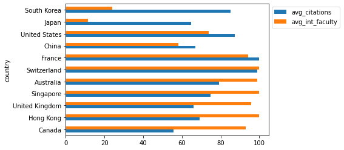
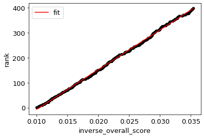

# Project 13: Databases and Plotting (UNDER CONSTRUCTION - DO NOT START)

<h2>Corrections/Clarifications </h2>

None yet.


**Find any issues?** Report to us:  

- Brian Huang <thuang273@wisc.edu>
- Yelun Bao <ybao35@wisc.edu>
- Soumya Suvra Ghosal <sghosal2@wisc.edu>

## Learning Objectives

In this project, you will demonstrate your ability to:

- Query a database using SQL 
- Process data using Pandas DataFrames and Numpy Arrays
- Create plots
- Write code with good style 

## Coding Style Requirements

Remember that coding style matters! **We might deduct points for bad coding style.** Here are a list of coding style requirements:

- Use meaningful names for variables or functions.
- Do not write the exact same code in multiple places. Instead, wrap this code into a function and call that function whenever the code should be used.
- Do not call unnecessary functions.
- Avoid using slow functions multiple times within a loop.
- Avoid inappropriate use of data structures. A bad example: use for loop to search for a corresponding value in a dictionary with a given key instead of use `dictname[key]` directly.
- Don't name variables or functions as python keywords or built-in functions. Bad example: str = "23".
- Don't define multiple functions with the same name or define multiple versions of one function with different names. Just keep the best version.
- Put all `import` commands together at the second cell of `main.ipynb`, the first cell should be submission information (netid and etc).
- Don't use absolute path such as `C://ms//cs220//p13`. **You may only use relative path**. When we test your work on a different operating system, all of the test will fail and you will get a 0. Don't panic when you see this, please fix the error and resubmit your assignment. Contact your TA if you need assistance with this task.


# Testing

For answers involving a DataFrame, `test.py` compares your tables to
those in `expected.html`, so take a moment to open that file in your
browser.

`test.py` doesn't care if you have extra rows or columns, and it
doesn't care about the order of the rows or columns.  However, you
must have the correct values at each row/column location shown in
`expected.html`.

For p13, `test.py` is pickier than it has been. In addition to
checking for incorrect answers, it will also check for a few common
instances of bad coding style. You should look for linting messages at the bottom
of the output, for example:

```
Linting Summary:
  Warning Messages:
    cell: 1, line: 4 - Redefining built-in 'id'
    cell: 1, line: 3 - Reimport 'numpy' (imported line 2)
    cell: 1, line: 5 - Unnecessary pass statement
    cell: 1, line: 2 - Unused import numpy
```

In this case, `test.py` will deduct 1 point per linter message because of
bad style, and at most deduct 10 points. For more information about the linter
as well as how to run the full linter to see all of the automatically generated
advice and feedback, please check out the [linting README](https://github.com/msyamkumar/cs220-f21-projects/tree/main/linter).

**Important**: Please make sure your linter works before you submit the project. If it's not working, please go to the office hours.

# Setup

To start, download [`test.py`](https://github.com/msyamkumar/cs220-f21-projects/blob/main/p13/test.py), and [`expected.html`](https://github.com/msyamkumar/cs220-f21-projects/blob/main/p13/expected.html).  You'll also need to download [`lint.py`](https://github.com/msyamkumar/cs220-f21-projects/blob/main/p13/lint.py). You'll do all your work in `main.ipynb`.

**Warning:** Do not download the dataset `QSranking.json` manually (you must write Python code to
download this automatically, as in p12). When we run the autograder, this file [`QSranking.json`](https://github.com/msyamkumar/cs220-f21-projects/blob/main/p13/QSranking.json) will not be in the directory. So, unless your `main.ipynb` downloads this file, you will get a **zero score** on the project. Also, make sure your `download` function includes code to check if the file already exists. The TAs will manually deduct points otherwise.

Once you have created the file, create a Dataframe named `rankings` from this file by using `pd.read_json('QSranking.json')`.  

In this project, you will be plotting graphs (similar to p9 and p11). Moreover, we will be dealing with many DataFrames. So, add these lines to one of the early cells in your notebook, to make your outputs more readable, and to pass `test.py`.

```python
# ensures that font.size setting remains permanent
%matplotlib inline 
pd.set_option('display.max_colwidth', None)
matplotlib.rcParams["font.size"] = 13 # don't use value > 13! Otherwise your y-axis tick labels will be different. 
```

# Introduction

For your final CS220 project, you're going to continue analyzing world university rankings. However, we will be using a different dataset this time. The data for this project
has been extracted from [here](https://www.topuniversities.com/university-rankings/world-university-rankings/2022). Unlike the CWUR rankings we used in p12, the QS rankings dataset has various scores for the universities, and not just the rankings. This makes the QS rankings dataset more suitable for plotting (which you will be doing a lot of!).

In this project, you'll have to dump your DataFrame to a SQLite database.
You'll answer questions by doing queries on that database.  Often, your answers will be in the form of a plot. Check these carefully, as the tests only verify that a plot has been created, not that it looks correct (TAs will manually deduct points for plotting mistakes).

Create your database by pasting the following code to your notebook. Make sure to include the import statement along with the other import statements.

```python
import sqlite3
```

```python
conn = sqlite3.connect('rankings.db')
rankings.to_sql("rankings", conn, if_exists = "replace", index = False)

# remember to do conn.close() at the end of your notebook or your code may crash when we run test.py.
```

If you named your DataFrame something other than `rankings`, tweak the above code to use your variable names.

Now, let's take a look at the details of the database. Paste the following code to your notebook:

```python
pd.read_sql("SELECT * FROM sqlite_master", conn)
```

What name do you see for the database table? Paste the following code to your notebook to explore the first seven lines of the database table. Tweak the code to change table name, if you used a different name for your DataFrame.

```python
pd.read_sql(
"""
SELECT *
FROM rankings
LIMIT 7
""", conn)
```

You should see a DataFrame that looks like this:


### WARNINGS: 
### 1. you must write SQL queries to solve this project questions, you will not get any credit if you use the pandas DataFrame directly to answer questions!
### 2. for plot questions,`test.py` can only detect if you have a plot, not if it is correct. So compare your plot with the plot shown below the question, and ensure that it matches, so you don't lose points during code review.
### 3. Your plots should **exactly** match with the plots shown for the plotting questions. This includes the labels as well as the order in which the bars appear (in case of bar graphs).

---

# Questions

### #Q1: In the year 2020, list the top 10 institutions in Canada which have the highest value in the column `international_students`.

**Note:** You should display `institution_name` and `international_students`. The rows should be in *descending* order of the column `international_students`.

Your output should be a **DataFrame** that looks like this:


**Hint:** To specify multiple conditions in the `WHERE` clause, you can use the `AND` condition as ```WHERE condition1 AND condition2 AND condition3```.


### #Q2: In the year 2019, list the top 10 institutions in the United States which have the highest score of (`academic_reputation + employer_reputation`).

**Note:** You should display `institution_name` and `reputation` of the top 10 institutions that have the highest combined score. The institutions should be displayed in *descending* order of reputation score. If the reputation scores are tied, then the institutions should be ordered in alphabetical order (*ascending*).

Your output should be a **DataFrame** that looks like this:


**Hint:** You can create the new column `reputation` using the `AS` keyword in SQL.

### #Q3: In the year 2020, list the top 10 countries which have the most institutions.

**Note:** You should satisfy the following requirements to get full credit:

* use `GROUP BY` in your SQL query
* use `COUNT` to count the total number of institutions in each country
* rename the count as `num_of_institutions`
* sort `country` by `num_of_institutions` (most first)
* in case `num_of_institutions` is tied, break ties between `country` alphabetically ("A" before "B", etc) 

Your output should be a **DataFrame** that looks like this:


### #Q4: In the year 2020, list the top 10 countries which have the most institutions. (answer with a plot)

Make sure to store the dataFrame from the Q4 SQL query execution and use that to answer this question!

**Note:** Answer with a **bar plot**. Put `country` on the x-axis and `num_of_institutions` on the y-axis. The countries should be sorted in the same order as in Q3. The color doesn't matter. Remember to remove the legend if your plot has the legend (e.g., [ax.get_legend().remove()](https://www.geeksforgeeks.org/how-to-remove-the-legend-in-matplotlib/)).

Your image should look like this:


### #Q5: In the year 2019, list the top 10 countries which have the highest total `overall_score`.

**Note:** You should satisfy the following requirements to get full credit:

* use `GROUP BY` in your SQL query
* use `SUM(overall_score)` to add up the `overall_score` value for each instituion in a country
* rename the sum as `total_score`
* sort `country` by `total_score` (most first)
* in case `total_score` is tied, break ties between `country` alphabetically ("A" before "B", etc) 

Your output should be a **DataFrame** that looks like this:


### #Q6: In the year 2019, list the top 10 countries which have the highest total `overall_score`. (answer with a plot)
Make sure to store the dataFrame from the Q5 SQL query execution and use that to answer this question!

**Note:** Answer with a **bar plot**. Put `country` on the x-axis and `total_score` on the y-axis. The countries should be sorted in the same order as in Q5. The color doesn't matter. Remember to remove the legend if your plot has the legend.

Your image should look like this:


### #Q7: In the year 2020, list the top 10 institutions in the United States which have the highest score of (`international_faculty + international_students`).

Recall that it is very easy to produce a new column by using an appropriate expression in the select clause.

**Note:** You should display `institution_name` and `international_score` of the top 10 institutions that have the highest combined score. The institutions should be displayed in *descending* order of `international_score`. If the scores are tied, then the institutions should be ordered in alphabetical order (*ascending*).

Your output should be a **DataFrame** that looks like this:


---


### #Q8: In the year 2018, what is the relationship between `citations_per_faculty` and `overall_score`?

**Note** : Answer with a **scatter plot** where each **institution** is represented as a point with `citations_per_faculty` on the x-axis and `overall_score` on the y-axis. 

Your image should look like this:


### #Q9: In the year 2019, what is the correlation between `(citations_per_faculty * international_faculty) / 100` and `overall_score`?

**Note** : Your output should be of **float** type representing the correlation between these quantities.

**Hint:** If you have a DataFrame `df`, then calling `df.corr()` will present a table showing the Pearson correlation between every pair of columns in df. A correlation value of 1 is the maximum (so, for example, every column is correlated perfectly with itself). A high correlation between columns X and Y means that large X values tend to coincide with large Y values and small X values tend to coincide with small Y values. In some of the questions, you'll observe negative correlations (-1 being the least possible). This means that large X values tend to coincide with small Y values and vice versa.

Here are the top 5 rows of the SQL query's return value DataFrame, prior to invoking corr() function. You can use this to verify your intermediate answer to this question. Please note that `institution_name` name is displayed just for verification purposes; your select clause need not select that column.


### #Q10: In the year 2019, what is the relationship between `academic_reputation` and `employer_reputation` for institutions in United States?

**Note** : Answer with a **scatter plot** where each **institution** is represented as a point with `academic_reputation` on the x-axis and `employer_reputation` on the y-axis. 

Your image should look like this:


### #Q11: In the year 2020, what is the relationship between `international_students` and `faculty_student_score` for the top institution in each country?

**Note:** Answer with a **scatter plot** where each **country** is represented as a point with `international_students` on the x-axis and `faculty_student_score` on the y-axis. The **top** institution from each country is the institution with the least value of the `rank` column from that country. 

**Hint:** You can use the `MIN()` function to return the least value of a selected column.

Your image should look like this:


### #Q12: Find the difference in correlation between `international_students` and `overall_score` in United States and United Kingdom for institutions ranked within the top 100 in the year 2020.

**Note** : Your output should be of **float** type representing the difference in the correlation between `international_students` and `overall_score` among the institutions with `rank <= 100` from the United States and the United Kingdom.


### #Q13: In the year 2019, find the top 15 countries which have the highest sum of `(citations_per_faculty * international_faculty) / 100`.

**Note** : Your output should be a **DataFrame** with the column `country` along with a *new column* `sum_citations` representing the sum of (`citations_per_faculty` * `international_faculty` / 100) for all institutions in that country. The countries should be displayed in *descending* order of their `sum_citations`.


### #Q14: In the year 2019, among the institutions ranked within the top 300, find the average of `(citations_per_faculty * international_faculty) / 100` for each country.

**Note** : Your output should be a **DataFrame** with the column `country` along with a *new column* `avg_citations` representing the average of (`citations_per_faculty` * `international_faculty`/ 100) for all institutions with `rank <= 300` from that country. You should display `country` and `avg_citations` only for those countries that have institutions ranked within top 300. These countries should be displayed in *descending* order of their `avg_citations`.

**Hint:** You can find the average of a column by either finding the `SUM()` and dividing by the `COUNT()` or by using `AVG()`.


### #Q15: In the year 2020, for each country, find the institution with the highest value for `(citations_per_faculty * international_faculty) / 100`.

**Note** : 
- Your output should be a **DataFrame** with the columns `country`, `institution_name` along with a *new column* `max_int_citations` representing the maximum value of (`citations_per_faculty` * `international_faculty` / 100 ) for that country. The countries should be displayed in *descending* order of `max_int_citations`.
- In the columns of `citations_per_faculty` and `international_faculty`, there are some missing values that are represented as `NaN` in the DataFrame. In general, SQL knows to skip these values, which is why you haven't had to deal with it so far. However, you are likely to notice some `NaN` values in your DataFrame. This happens when all of the institutions in a country have missing data. In that case, `MAX()` cannot be computed, and `NaN` is returned. To filter out those missing values, you need to add in a condition like `WHERE your_column IS NOT NULL` in your SQL query. You are **required** to filter out `NaN` values.

**Hint:** You can use the MAX() function to return the largest value of a selected column.


### #Q16: In the year 2018, among the institutions ranked within the top 50, generate a barplot visualizing the average of `citations_per_faculty` and `international_faculty` for each country. (answer with a plot)

**Note** : You need to answer with a **horizontal bar plot**. You should define columns `avg_citations` and `avg_int_faculty` representing the average value of `citations_per_faculty` and `international_faculty` for each country respectively. Put `country` on the x-axis and `avg_citations` and `avg_int_faculty` on the y-axis. Make sure your plot has a legend, however the position of the legend doesn't matter. Make sure the countries appear in *decreasing* order of the difference between `avg_citations` and `avg_int_faculty`. The colors don't matter either.

**Warning:** `test.py` can only detect if you have a plot here, not if it is correct. So compare your plot with the plot here, and ensure that it matches, so you don't lose points during code review.

Your image should look like this:



---
### Fitting a regression line.

Linear regression is a very simple but useful model to fit scatter plots. Usually, we fit a `y = m * x + n` line to the scatter plots using the least-squares method.

For the regression line, first try copy/pasting this code into a notebook cell and running it to see what happens:

```python
import numpy as np

df = pd.DataFrame({
    "x": [1,2,3,4],
    "y": [2,5,6,5]
})
df["1"] = 1

res = np.linalg.lstsq(df[["x", "1"]], df["y"], rcond=None)

# res is a tuple: (COEFFICIENTS, VALUE, VALUE, VALUE)
coefficients = res[0] # coefficients is (m,n)
m = coefficients[0] # slope
n = coefficients[1] # intercept
ax = df.plot.scatter(x='x', y='y', color='black')

df["fit"] = df["x"] * m + n
df.plot.line(x='x', y='fit', c='red', ax=ax)
```

### #Q17: For all the institutions in the year 2020, what is the relationship between `overall_score` and `rank`? (answer with a plot)

**Note:** Your output should be a **scatter plot with a regression line** where each **institution** is represented as a point with with `overall_score` on the x-axis and `rank` on the y-axis.

**Hint:** You can adapt the above code so that it uses your DataFrame (instead of df) and replace `x` with `overall_score` and `y` with `rank`.

**Warning:** `test.py` can only detect if you have a plot here, not if it is correct. So compare your plot with the plot here, and ensure that it matches, so you don't lose points during code review.

Your image should look like this:


*Does our linear regression model fit the points well? It looks like the relationship between the* `overall_score` *and* `rank` *is not quite linear. In fact, the relationship appears to be inverse.*

### #Q18: For all the institutions in the year 2020, what is the relationship between  `1 / overall_score` and `rank`? (answer with a plot)

**Note:** Your output should be a **scatter plot with a regression line** where each **institution** is represented as a point with with `inverse_overall_score` on the x-axis and `rank` on the y-axis.

**Warning:** `test.py` can only detect if you have a plot here, not if it is correct. So compare your plot with the plot here, and ensure that it matches, so you don't lose points during code review.

Your image should look like this:



*This seems to be much better! Let us now use this regression line to estimate the* `rank` *of an institution given its* `overall_score`.

### #Q19: Use the regression line to estimate the rank of an institution with `overall_score` of 72.

**Note:** Your output should be an **int**. If your estimate is a float, *round it up* using `math.ceil`.

**Hint:** You should use the coefficients `m, n` you found in Q18 to answer this. Recall that the equation of a line is `y = m*x + n`. What are `x` and `y` here?

*Can you find out the* `overall_score` *of the university with this* `rank` *in the year 2020? Does it match your prediction?*
 
---

### #Q20: What are the top 10 countries that have the most institutions in 2020? (answer with a plot)

**Note:** Your output should be a **pie chart**. The colors on the pie chart don't matter, but the chart should be titled `Number of institutions`, and should be labelled as in the sample output below. Make use of the output of Q3 here.

**Hint:** Use [df.plot.pie](https://pandas.pydata.org/docs/reference/api/pandas.DataFrame.plot.pie.html) to plot your graph.

**Warning:** `test.py` can only detect if you have a plot here, not if it is correct. So compare your plot with the plot here, and ensure that it matches, so you don't lose points during code review.

Your image should look like this:


### WARNING: Close the database connection in the last cell. Not doing this will make autograder fail. Please do this right away and save your precious time.

---

### Before turning in:
Be sure to run test.py and make sure there are no errors. If you turn in a version of your code which fails on test.py (i.e. you can't see which questions you got right or not), **we will deduct 5 points**. If the autograder is failing but you still want to turn in, you can see which question it is failing on and comment out the code for that question, essentially leaving it out. 


After you add your name and the name of your partner to the notebook in the first cell, please remember to Kernel->Restart and Run All to check for errors then run the `test.py` script one more time before submission. To keep your code concise, please remove your own testing code that does not influence the correctness of answers.

