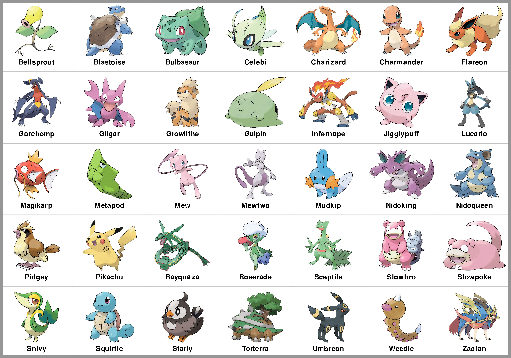

# Project 4: Pokémon Battle Simulation

### Corrections and Clarifications

Find any issues? Report to us:

  * Brian Huang [thuang273@wisc.edu](mailto:thuang273@wisc.edu)
  * Abhay Punjabi [apunjabi@wisc.edu](mailto:apunjabi@wisc.edu)
  
---
### Learning Objectives

In this project, you will demonstrate how to

  * Use conditional statements to implement decisions
  * Write functions using parameters, return values, and conditional logic
  * Use good coding practices as outlined in Lab P4

Please go through [lab-p4](https://github.com/msyamkumar/cs220-f21-projects/tree/main/lab-p4) before working on this project. The lab introduces some useful techniques related to this project.

## Overview

For this project, you'll be using the data from `pokemon_stats.csv` and `type_effectiveness_stats.csv` to simulate Pokémon battles. This data was gathered by the Python program `gen_csv.ipynb` from the website https://www.pokemondb.net/.

This project will focus on conditional statements. To start, download `project.py`, `test.py`, `type_effectiveness_stats.csv` and `pokemon_stats.csv`. You'll do your work in a Jupyter Notebook, producing a `main.ipynb` file. You'll test as usual by running `python test.py` to test your `main.ipynb` file.

We won't explain how to use the project module here (the code in the `project.py` file). The lab this week is designed to teach you how it works. So, before starting p4, take a look at [lab-p4](https://github.com/msyamkumar/cs220-f21-projects/tree/main/lab-p4).

This project consists of writing code to answer 20 questions. If you're answering a particular question in a cell in your notebook, you need to put a comment in the cell so we know what you're answering. For example, if you're answering question 13, the first line of your cell should start with `#q13` or `#Q13`.

In this project, you will have to write several functions and keep adding more details to them according to the instructions. When you are adding more things in your functions, we want you to follow the Good Coding Style for Functions described in [lab-p4](https://github.com/msyamkumar/cs220-f21-projects/tree/main/lab-p4). Therefore, you should only keep the latest version of your functions in your notebook file. For example, in p4 you are asked to write 6 functions(`damage`, `type_bonus`, `effective_damage`, `num_hits`, `battle`, and `two_on_two_battle`), so there should only be one version of each of these 6 functions in your submitted notebook file.

The first cell should contain this:

```python
# project: p4
# submitter: NETID1
# partner: NETID2
# hours: ????
```
**Note that**:
* You are only allowed to work with your named partner,
* You must name the person you worked with, and
* Only one of you should submit your code.

## Questions and Functions

In this project, we will be simulating Pokémon battles! Before we proceed any further, let us take a look at the Pokémon we will be dealing with, in this project:



Now, here are the *rules* governing Pokémon battles:

1. A Pokémon battle takes place between two Pokémon.
2. The two Pokémon take turns attacking each other.
3. The Pokémon with the higher Speed stat attacks first.
4. On each turn, the attacking Pokémon can choose between two modes of attack - Physical
or Special.
5. In addition to the attack mode, each Pokémon can choose the type of its attack.
6. Based on the move chosen by the attacking Pokémon, the defending Pokémon
receives damage to its HP.
7. If a Pokémon's HP drops to (or below) 0, it faints and therefore loses
the battle.
8. However, if one Pokémon is much stronger than the other, then the weaker Pokémon will run away instead of fighting.

---
Whoa! There's a lot going on there! Throughout this project, we will break this down into smaller parts and slowly build up to the `battle` function.

The first thing we need to do is calculate the damage caused by one Pokémon's attack on another Pokémon. To accomplish this, we need to create a function `damage(attacker, defender)`.

The `attacker` can choose between two attack modes - Physical or Special. The damage caused by the attacker's Physical move is `10 * Attack stat of Attacker / Defense stat of Defender`, and the damage caused by the attacker's Special move is `10 * Sp. Atk. stat of Attacker / Sp. Def. stat of Defender`.

**If the attacker wants to win, it should always choose the move which will do more damage.** So, that is what we want our function `damage` to do. We want this function to find out which mode of attack the attacker would choose, and return the damage that the attacker would do to the defender.

Copy/paste the following code in a new cell of your notebook and fill in the details.

```python3
def damage(attacker, defender):
    physical_damage = 10 * project.get_attack(attacker) / project.get_defense(defender)
    special_damage = ???
    if ???:
        return physical_damage
    else:
        return ???
```

Now, let's find out if this function works! Use `damage` to answer the next two questions.

### #Q1: How much damage does Scraggy do to Golem?


### #Q2: How much damage does Magnemite do to Nidorina?

---
In addition to choosing the attack *mode* (i.e. Physical or Special), the attacker can also (sometimes) choose the *type* of attack. Before we figure out what type the attacker should choose, we first need to find out the *effect* of the attack on the defender. Each attack type offers a *type bonus* to the attack damage that we calculated with the `damage` function.

If the attacker chooses an attack of type `attack_type` against a `defender` with only one type `type1`, then the type bonus of this attack is `get_type_effectiveness(attack_type, type1)`. If the `defender` has two types `type1` and `type2`, then the type bonus of this attack is `get_type_effectiveness(attack_type, type1) * get_type_effectiveness(attack_type, type2)`.

For example, let the `attack_type` be Fire and the defender be the Pokémon Squirtle. Squirtle has only one type, Water (with its Type 2 being `"None"`). In this case, we see that

```python3
>>> project.get_type_effectiveness("Fire", "Water")
0.5
```

Therefore, the type bonus of a Fire type attack on Squirtle is `0.5`. On the other hand, consider a Fire type attack on the Pokémon Bulbasaur. Bulbasaur has 2 types, Grass and Poison. In this case, we see that

```python3
>>> project.get_type_effectiveness("Fire", "Grass")
2.0
>>> project.get_type_effectiveness("Fire", "Poison")
1.0
```

Therefore, the type bonus of a Fire type attack on Bulbasaur is the product of these two numbers and is therefore, `2.0 * 1.0 = 2.0`.

We are now ready to write the function `type_bonus`, which will calculate the type bonus of an `attack_type` against a `defender`. We've provided a code snippet for this function below:

```python3
def type_bonus(attack_type, defender):
    defender_type1 = ???
    defender_type2 = ???
    bonus = project.get_type_effectiveness(attack_type, defender_type1)
    if ???:
        ???
    return bonus
```

Use this function to answer the next two questions.

### #Q3: How effective is Electric type against Magikarp?


### #Q4: How effective is Bug type against Gastly?

---
When an `attacker` chooses an attack of type `attack_type` against a `defender`, the damage done is `type_bonus(attack_type, defender) * damage(attacker, defender)`.

An attacker can choose between any of its types for its attack type. So, if an attacker has two types, it can choose either Type 1 or Type 2 as its attack type. However, if it has only one type (i.e. its Type 2 is `"None"`), it has no choice but to choose its Type 1 as its attack type. For example, a Pokémon like Weedle which has two types (Bug and Poison) can choose to make its attack either Bug type or Poison type. On the other hand, a Pokémon like Magikarp which has only one type (Water) can only make its attack a Water type attack.

While a Pokémon with only one type doesn't have a choice, a Pokémon with two types can choose between its two types. **if the attacker wants to win, it should always choose the type which will do more damage.**

Let us consider the case when an **attacker has only one type. (i.e. Type 2 is 'None')**

To illustrate this, we take Magikarp as the attacker and Charizard as the defender. Let us first ensure that Magikarp has only 1 type.

```python3
>>> project.get_type1("Magikarp") 
'Water'
>>> project.get_type2("Magikarp")
'None'
```
In this case, we simply take the `type_bonus` of the first type against Charizard (the defender).

```python3
>>> type_bonus(project.get_type1("Magikarp"), "Charizard")
2.0
>>> bonus = type_bonus(project.get_type1("Magikarp"), "Charizard")
```
`bonus` should contain the value `2.0`.
To calculate the **effective damage** that Magikarp does to Charizard, we take `damage("Magikarp","Charizard") * bonus`

```python3
>>> damage("Magikarp","Charizard") * bonus
3.5294117647058822
```

We will now consider the case where an **attacker has two types**.

To illustrate this, we take Weedle as the attacker and Charizard as the defender.
If your `type_bonus` function works correctly the values obtained by measuring the type bonus of Weedle against Charizard is

```python3
>>> type_bonus(project.get_type1("Weedle"), "Charizard")
0.25
>>> type_bonus(project.get_type2("Weedle"), "Charizard")
1.0
```
Clearly, Weedle's second type (Poison) causes more damage to Charizard than its first type (Bug). So, **Weedle would choose its Poison type attack instead of its Bug type attack against Charizard**. 

Therefore, the effective `bonus` is `1.0`.

So, the **effective damage** that Weedle does to Charizard is `damage("Weedle","Charizard") * bonus`

```python3
>>> bonus = max(type_bonus(project.get_type1("Weedle"), "Charizard"), type_bonus(project.get_type2("Weedle"), "Charizard"))
>>> bonus
1.0
>>> damage("Weedle","Charizard") * bonus
4.487179487179487
```

We now write a function `effective_damage` to compute the actual damage that an attacker would do to the defender, taking into account, both the attack mode and attack type.

```python3
def effective_damage(attacker, defender):
    pass
    #TODO: compute the bonus of attacker's type(s) against defender
    #TODO: check if attacker has two types
    #TODO: find the attack_type with the higher bonus
    #TODO: compute the damage caused by attack and return it
```

Use the `effective_damage` function to answer the next three questions.

### #Q5: How much damage does Mewtwo do to Gengar?


### #Q6: How much damage does Wooper do to Pikachu?


### #Q7: How much damage does Slowpoke do to Steelix?

---
Now that we have a way of calculating the damage done by the Pokémon during battle, we have to calculate how many hits each Pokémon can take before fainting.

The number of hits a Pokémon can take is calulated by taking its HP and dividing it by the attacking Pokémon's **effective damage**.

Note that if the defending pokemon has 30 HP and the attacking pokemon does 20 damage each turn, it will take 2 turns before the defender faints instead of 30 / 20 = 1.5. You might want to use the method math.ceil() here. First import the module math (remember to add the `import math` call at the top of your notebook) and then look up the documentation of math.ceil to see how you could use it.

Copy/paste the following code in a new cell of your notebook and fill in the details.

```python3
def num_hits(attacker, defender):
    return math.ceil(project.get_hp(???)/???)
```

Use `num_hits` to answer the next two questions.

### #Q8: How many hits can the defending pokemon Slowpoke take from Metapod (attacker)?

### #Q9: How many hits can the defending pokemon Snivy take from Pikachu (attacker)?

---
With the tools we have created so far, we can now finally start creating our battle simulator! Copy/paste the following code in a new cell of your notebook and fill in the details.

```python3
def battle(pkmn1, pkmn2):
    pass
    #TODO: Return the name of the pkmn that can take more hits from the other
    # pkmn. If both pkmn faint within the same number of moves, return the
    # string 'Draw'
```
Use `battle` to answer the next two questions.

### #Q10: What is the output of battle('Krabby', 'Sceptile')?


### #Q11: What is the output of battle('Heracross', 'Blastoise')?

You may have noticed that the function battle does not quite follow all the rules that we laid out at the beginning. Look at the output of `battle('Weedle', 'Metapod')`. You will find that it is a draw, since they can both take 7 hits from the other Pokémon. But since Weedle has a higher Speed, it attacks first, so it will land its fourth hit on Metapod, before Metapod gets its turn to hit Weedle. So, even though they both go down in the same number of moves, Weedle should win the battle.

Go back and modify `battle` so that if both Pokémon faint in the same number of moves, the Pokémon with the higher Speed wins. If they both have the same Speed, then the battle should be a 'Draw'.

Use `battle` to answer the next two questions.

### #Q12: What is the output of battle('Starly', 'Pidgey')?


### #Q13: What is the output of battle('Bulbasaur', 'Spearow')?

One last rule we need to implement is the run away feature. For example, consider a battle between Pikachu and Glaceon. Glaceon can take 13 hits from Pikachu, but Pikachu can only take 2 hits from Glaceon. Because of this massive difference, Pikachu should choose to run away from this battle.

Modify battle so that if one Pokemon can take more than 10 hits than the other, the one who is weaker runs away. The function should return `"<pkmn_name> ran away"`. Make sure the function says the Pokémon that can take less hits ran away!

Hint: Even though this is the last rule, it is the first thing that the battle function should determine.

### #Q14: What is the output of battle('Heatran', 'Bellsprout')?


### #Q15: What is the output of battle('Meditite', 'Gyarados')?


### #Q16: What is the output of battle('Mudkip', 'Gulpin')?

---
The essence of the Pokémon anime comes in the form of beautifully animated team battles. To simulate these team battles, we will create a simple 2 v/s 2 game where 2 teams with 2 Pokémon each compete in a battle.

The function `two_on_two_battle(pkmn1, pkmn2, pkmn3, pkmn4)` takes 4 Pokémon. Pokémon 1 and 2 are in Team A while Pokémon 3 and 4 are in Team B.

In the **first round**, Pokémon 1 and 3 battle each other and Pokémon 2 and 4 battle each other. Your function should use the `battle(pkmn1,pkmn2)` function to evaluate the result of each battle.

If either battle results in a `"Draw"` or in either Pokémon running away, your function should return `"No result"`.

If the winning Pokémon are both from the same team, in other words, if both Pokémon 1 and 2 win their battles, your function should return `"Team A wins"`. Similarly if Pokémon 3 and 4 win their battles, your function should return `"Team B wins"`.

However, there can be battles when the winning Pokémon from the first round are from different teams. For example Pokémon 2 can win its battle against Pokémon 4 but Pokémon 1 can be defeated by Pokémon 3. In this case, the team battle proceeds to the **second round**.

The winning Pokémon from each team battle one last time, and the victor of this battle takes the battle for its team. Continuing from the previous example, Pokémon 2 and Pokémon 3 will battle in the second round. If Pokémon 2 were to win this battle, your function should return `"Team A wins"`. Conversely, if Pokémon 3 defeats Pokémon 2, your function should return `"Team B wins"`.

Again, if the battle results in a `"Draw"` or in either Pokémon running away, your function should return `"No result"`.

Create a function `two_on_two_battle` and use it to answer the next four questions. We recommend that you build this up slowly (just like we did with `battle`). Don't try to write the entire function at once. Break it down, and implement the first round of the team battle first, and then proceed to the second round. You may use any of the helper functions we have created thus far, and you may create more helper functions if you feel they are necessary.

```python3
def two_on_two_battle(pkmn1, pkmn2, pkmn3, pkmn4):
    # TODO: implement the first round
    # TODO: implement the second round
    pass
```

### #Q17: What is the output of two_on_two_battle('Squirtle', 'Mudkip', 'Infernape', 'Charizard')?


### #Q18: What is the output of two_on_two_battle("Umbreon", "Flareon", "Jolteon", "Glaceon")?


### #Q19: What is the output of two_on_two_battle("Electivire", "Arcanine", "Greninja", "Charizard")?


### #Q20: What is the output of two_on_two_battle('Flygon', 'Sceptile', 'Garchomp', 'Torterra')?

That will be all for now. If you are interested, you can make your battle functions as complicated as you want. You can even try a 3 on 3 battle to test your coding prowess thus far! We look forward to seeing the other fun functions you create!

---
**WARNING: Please remember to Kernel->Restart and Run All to check for errors, save your notebook, then run the test.py script one more time before submitting the project. To keep your code concise, please remove your own testing code that does not influence the correctness of answers. Finally, if you are unable to solve a question and have partial code that is causing an error when running test.py, please comment out the lines in the cell for that question before submitting your file. Failing to do so will cause the auto-grader to fail when you submit your file, giving you 0 points even if you have some questions correctly answered.**

Have fun!
