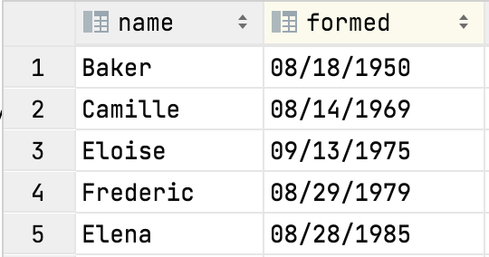

# Project 5: Hurricanes Study using Loops


## Corrections and clarifications

None yet.

**Find any issues?** Report to us: 

- Dyah Adila <adila@wisc.edu>
- Parker Lougheed <plougheed@wisc.edu>

## Learning objectives

In this project, you will demonstrate how to

* Write fundamental loop structures
* Learn basic string manipulations 
* Creating your own helper functions as outlined in 
  [lab-p5](https://github.com/msyamkumar/cs220-f21-projects/tree/main/lab-p5)

**Please go through [lab-p5](https://github.com/msyamkumar/cs220-f21-projects/tree/main/lab-p5) 
before working on this project.** 
The lab introduces useful techniques related to this project.

## Overview

This project will focus on **loops** and **strings**.

Hurricanes often count among the worst natural disasters, 
both in terms of monetary costs and, more importantly, human life.
Data Science can help us better understand these storms.
For example, 
take a quick look at this FiveThirtyEight analysis by Maggie Koerth-Baker:
[Why We're Stuck With An Inadequate Hurricane Rating System](https://fivethirtyeight.com/features/why-were-stuck-with-an-inadequate-hurricane-rating-system/)

For this project, you'll be analyzing data in the `hurricanes.csv` file.
We generated this data file by writing a Python program
to extract stats from Wikipedia's 
[List of United States hurricanes](https://en.wikipedia.org/wiki/List_of_United_States_hurricanes).
By the end of this semester, we'll teach you to extract data
from websites like Wikipedia for yourself.

Before you start to work on p5, 
please complete [lab-p5](https://github.com/msyamkumar/cs220-f21-projects/tree/main/lab-p5) first.

To start, download `project.py`, `test.py` and `hurricanes.csv`. 
You'll do your work in Jupyter Notebooks this week, 
producing a `main.ipynb` file.
You'll test as usual by running `python test.py` 
to test a `main.ipynb` file
(or `python test.py other.ipynb` to test a notebook with a different name).
If needed, you may only use standard Python modules such as `math`.
Please don't use `pip` to install any additional modules
as these are not considered standard modules.

We won't explain how to use the `project` module here 
(the code in the `project.py` file).
The lab this week is designed to teach you how it works.

This project consists of writing code to answer 20 questions.
If you're answering a particular question in a cell in your notebook, 
you need to put a comment in the cell so we know what you're answering.
For example, if you're answering question 13, 
the first line of your cell should start with `#q13` or `#Q13`.

## Questions and functions

For the first three questions, 
you don't have to define any functions of your own. 
Instead you should just make use of the functions provided
in the file `project.py` by calling the corresponding function
that you need to solve a particular problem.

*Please note*, for questions asking you
to get a value at a particular **index**,
you should not confuse it with the actual **location**
of that value in the dataset. 
Indexing in python begins from 0.

For example, consider this excerpt from `hurricanes.csv`:



The **index** for the Hurricane Eloise is 2 but its actual **location** is 3.
Therefore, you must follow this convention for all the questions
asking for the value at a particular index.

### #Q1: How many hurricanes are recorded in the dataset?

### #Q2: What is the name of the hurricane at index 86?

### #Q3: How many deaths were caused by the hurricane at the last index?

**Important:** Your code should work even if
the number of hurricanes in the dataset later changes. So, don't
**hardcode** the index of the last hurricane.

### #Q4: How many hurricanes named Omar are in the dataset?

Write your code such that it counts all potential variants
(e.g., "Omar", "OMAR", "oMaR", etc.).

### #Q5: What is the slowest MPH a hurricane has ever gone?

### #Q6: How much faster was the fastest hurricane compared to the slowest hurricane in the dataset?

---

### #Q7: What is the damage (in dollars) caused by hurricane "Sandy"?

There is only one hurricane in the dataset named "Sandy". So, you don't
have to worry about duplicates.

**Note**: Your answer should be in the form of an integer.

**Be careful!** 
In the data, the number was formatted with a suffix (one out of "K", "M" or "B"), 
so you'll need to do some processing to convert it.

Since you will need to format damages for future questions as well, 
you should create a general helper function
that handles the "K", "M", and "B" suffixes (it will be handy later).
Remember that "K" stands for thousand, "M" stands for million, 
and "B" stands for billion! 
For example, your function should convert a string from "13.5M" to 13500000, 
"6.9K" to 6900 and so on.

**Hint:** Use `float()` in the `format_damage` function for the numbers with 
decimal points before multiplying by `1000`, `1,000,000` or `1,000,000,000`.

```python
def format_damage(damage):
    #TODO: Check the last character of the string
    #TODO: Then convert it to appropriate integer by slicing and type casting
    pass
```

### #Q8: What is the name of the hurricane which did the most damage?

**Important:** If you find multiple hurricanes with the same damage,
you should consider the **first** one you find.

**Hint:** You will want to use the `format_damage` function
you created for the previous question.

### #Q9: What is the speed of the hurricane which did the most damage?

**Important:** If you find multiple hurricanes with the same damage,
you should consider the **first** one you find.

**Hint:** If you find the index of the hurricane which did the most 
damage in Q8 instead of just the name of the hurricane, 
you can solve Q9 very easily with `project.get_mph(most_damage_idx)`

### #Q10: What is the total damage caused by hurricanes with names starting with the letter E?

This question is case insensitive.

---

### Function Suggestion:

We suggest you complete a function something like the following
to answer the next several questions 
(this is **not** a requirement if you prefer to solve the problem another way):

```python
def deadliest_in_range(year1, year2):
    """Gets the index of the deadliest hurricane formed or dissipated within the given year range"""
    worst_idx = None
    for i in range(project.count()):
        if ????:  # TODO: Check if year is in range
            if worst_idx is None or ????:  # TODO: Is it worse than the previous deadliest hurricane?
                # TODO: Finish this code
    return worst_idx
```

**Important:** By 'deadliest' we refer to the hurricane which causes the most deaths 
(*not* the most damage).

**Hint:** You can copy the `get_month`, `get_day`, and `get_year`
functions you created in lab to your project notebook if you like.

### #Q11: What is the name of the deadliest hurricane active in the 20th century (1901 to 2000, inclusive)?

For this and the following, 
we say a hurricane was active in a year, if it was formed or dissipated in that year.

**Important:** If there is more than one hurricane with the same amount of deaths,
consider the **last** one in the data set.

### #Q12: Which year in the dataset witnessed the formation of the deadliest hurricane?

**Note:** Your answer should be in the form of an integer.

**Hint:** You can still use `deadliest_in_range` here, if you cleverly choose
your arguments.

### #Q13: How much damage was done by the deadliest hurricane this century thus far (2001 to 2021, inclusive)?

**Note:** Your answer should be in the form of an integer.

### #Q14: What is the speed of the fastest hurricane which resulted in 0 deaths?

Just like other questions, you **cannot** hard code your answer. 
If hurricanes were being added or removed to the `hurricanes.csv`, your code should still be correct.

---

### Function Suggestion:

We suggest you complete a function something like the following to
answer the next several questions 
(this is **not** a requirement if you prefer to solve the problem another way):

```python
def get_year_total(query_year):
    """Gets the amount of hurricanes formed in the specified year"""
    num_of_hurricanes = 0
    for i in range(project.count()):
        pass # TODO: finish this code!
    return num_of_hurricanes
```

### #Q15: How many hurricanes were formed in the year 2002?

### #Q16: How many hurricanes were formed in the last decade (2011 to 2020, inclusive)?

**Hint:** We suggest you complete a function like the following to
answer Q16. It *may* be of use later.
(this is **not** a requirement if you prefer to solve the problem another way):

```python
def get_decade_total(start_of_decade):
    total_hurricane_decade = 0
    for year in range(???):
        total_hurricane_year = get_year_total(year)
        # TODO: finish this code
    return total_hurricane_decade
```

### #Q17: Which decade in the 20th century suffered the most number of hurricanes?

Your answer should be a string such as `"1951 to 1960"` or `"1991 to 2000"`.

**Hint:** You can check whether a year is the start of a decade (e.g. 2001, 1921, etc) 
by checking the remainder of the year when divided by 10

---

### #Q18: How many hurricanes lasted across at least 2 different months?

**Hint:** You can compare the month the hurricane formed and the month it dissipated.

### #Q19: Which of two hurricanes took longer to dissipate: Dora or Karen?

There is only hurricane in the dataset named "Dora" and only one named "Karen". So, you don't
have to worry about duplicates.

**Hint:** You can use the `get_number_of_days()` function you created in lab to answer this question.

### #Q20: What is the name of the last hurricane to dissipate before the formation of the deadliest hurricane between 1981 and 2000 (inclusive)?

**Important:** You may **not** assume that the hurricanes are in chronological order in the dataset.

**Hint:** Look for functions you wrote earlier than can help you here.

**Extra hint:** Remember that `get_number_of_days(start_date, end_date)` will be negative
if `start_date` occurs after `end_date`.

---

#### READ ME

**Please remember** to `Kernel->Restart and Run All` to check for errors, 
save your notebook, then run the test.py script
one more time before submitting the project. 
To keep your code concise, 
please remove your own testing code
that does not influence the correctness of answers. 

**Finally,** if you are unable to solve a question and have partial code
that is causing an error when running test.py, 
please comment out the lines in the cell for that question 
before submitting your file. 
Failing to do so will cause the auto-grader to fail when you submit your file 
and give you 0 points even if you have some questions correctly answered.

Good luck with the hurricane data project :) 
