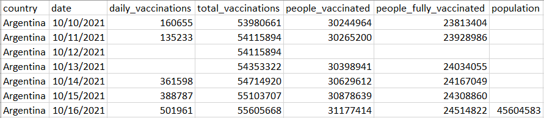
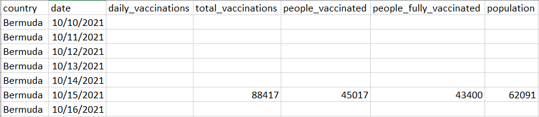

# Project 7: COVID-19 Vaccination 

## Corrections/ Clarifications

 * **(10/20/2021 - 10:30am)**: Q17 and Q18 reworded. References to 'single dose' replaced with the term 'partly vaccinated'.

**Find any issues?** Report to us, 

- CHAITANYA KABRA <ckabra@wisc.edu> 
- ABHAY PUNJABI <apunjabi@wisc.edu>.

### Learing objectives

 In this project, you will

* demonstrate how to write programs to interpret data present in csv files;
* demonstrate how to organize messy real-world data into something manageable;
* demonstrate how to use dictionaries effectively to answer questions;
* **develop good coding styling habits (points may be deducted for bad coding styles)**.


## Intro

Let's track COVID-19 vaccination, Python style!  In this project, you will get more practice with lists and start using dictionaries. Start by downloading `test.py` and `vaccinations.csv` (which was adapted from [this dataset](https://ourworldindata.org/covid-vaccinations)). This dataset is too large to preview on GitHub (>55K rows), but you can view the [raw version](https://raw.githubusercontent.com/msyamkumar/cs220-f21-projects/main/p7/raw_covid_data.csv) or using a program such as [Excel](https://github.com/msyamkumar/cs220-f21-projects/blob/main/p7/excel.md). For this project, you'll create a new `main.ipynb` and answer questions in the usual format. **Please go through the [lab-p7](https://github.com/msyamkumar/cs220-f21-projects/tree/main/lab-p7) before working on this project.** The lab will introduce some useful techniques related to this project.

### Coding style requirements

* Don't name the variables and functions as python keywords or built-in functions. Bad example: str = "23".
* Don't define functions with the same name or define one function multiple times. Just keep the best version.
* Please put the 4-line submission information in the first cell of `main.ipynb`.
* Put all `import` commands together at the second cell of `main.ipynb`.
* Please don't import any modules that we didn't ask you to import, **TAs will deduct points for additonal imports.**


## The Data

We will be analyzing data about COVID-19 vaccinations across all the countries in the world, over the past week. Open `vaccinations.csv` with a Spreadsheet viewer, and look at the data for yourself. As we can see, we have data from each country and for each day of the last week about

* `daily_vaccinations` - number of vaccines administered on that day
* `total_vaccinations` - total number of vaccines administered in total upto that day.
* `people_vaccinated` - total number of people who have received at least one shot of the vaccine.
* `people_fully_vaccinated` - total number of people who have received both doses of the vaccine.
* `population` - population of the country 

Notice that a lot of the data is missing in this dataset. This is often the case with real world data. In this project, we will also have to carefully parse missing data, and make good use of the data we do have in our analysis.

**Important Note:** You may assume for this project, that the dates are all sorted in increasing order in the dataset. In other words, the dates appear in the order 10/10/2021 to 10/16/2021. Moreover, you may assume that the data is grouped by the countries. So, all the data for one country appears together, followed by the data for another country, and so on, just as in `vaccinations.csv`.

Let's get started! To parse the data to your notebook, paste the following (from lab-p6) in an early cell:

```python
import csv

# Modified from https://automatetheboringstuff.com/chapter14/
def process_csv(filename):
    example_file = open(filename, encoding="utf-8")
    example_reader = csv.reader(example_file)
    example_data = list(example_reader)
    example_file.close()
    return example_data
```

Use this function to read the data from `vaccinations.csv`.
Extract the `header` and `covid_data`. Recall that indexing helps you extract the first inner list as header and slicing would help you extract the data rows (remaining inner lists).
Consider peeking at the first few rows of the dataset!

If you look closely, our program interprets the missing values as '' characters.
Recall that you learnt how to write a cell function in [lab-p6](https://github.com/msyamkumar/cs220-f21-projects/tree/main/lab-p6). Write a similar cell function to handle missing values and typecast values based on column names.

## Let's Start!

**Warning:** Do **not** hardcode the column indices anywhere in your code. You will **lose points** during code review if you do so. Instead, use `.index()` as you did in p6.


### #Q1: What dates are mentioned in the dataset?

**Note:** Your answer should be a **list** of the unique dates in the dataset. The list does not have to be sorted.

1. Create an empty list to track dates
2. Iterate:
	- use cell function to retrieve date
	- to use cell function, should you iterate over values or indices?
	- add date to the list
3. Which data structure can you use to eliminate duplicates?

### #Q2: What countries are listed in the dataset?
**Note:** Your answer should be a **list** of the countries in the dataset. The list should be sorted in alphabetical order.

1. Repeat steps 1 to 3 from Q1 with modification
2. Sort the list using appropriate function / method.

---

Before we look at some of the other more interesting columns, let us consider the `population` column in the dataset.

### #Q3: What are the populations of all the countries in the dataset?

**Note:** Your answer should be a **dict** mapping each country to its population.

Notice that population data is present only on (at most) one row for each country. You need to identify the row which contains the data for each country, and extract it.

**Warning:** We do not have any population data for some countries. Such countries should appear in your dict with value `None`.

Here is a code snippet for you to start with:

```python
populations = {} #key: country name, value: popluation

for row_idx in range(???):
    country = ???
    population = ???
    if country not in populations:
        populations[country] = None # Initial place holder for country, we will replace this using next condition
    if ???: # TODO: check that the population data is not missing
        populations[???] = ??? # TODO: add the key-value pair to the dict
```


---

Now, let us focus on the `daily_vaccinations` column. We now have to decide how to deal with the missing data in this column. We have several choices ahead of us. For instance, we could perform linear interpolation using the available data to estimate the `daily_vaccinations` when the data is missing. However, given the nature of the dataset, let us err on the side of caution. If the `daily_vaccinations` data is missing for a certain date, **we will ignore that date**. In effect, we make the conservative estimate that the number of vaccinations on that date is 0.

### #Q4: How many countries have daily vaccination date for the date '10/12/2021'?

**Note:** Your answer should be an **int**.

1. Create an empty list to track country names
2. Iterate over the data
	- use cell function calls to retrieve relevant column information
	- check for date match
	- if vaccination data is not missing, add country to the list
3. Get unique country names - what data structure will be useful here?
4. How can you find the count of unique country names? 

### Function suggestion:

We will now create a function `daily_vaccinations_on` to deal with the missing data in the `daily_vaccinations` column. Note that when the data is missing for a certain date, we want the value to be `None`.

Note that this function is a **requirement**, and you will **lose points** if you do not implement this function.

```python
def daily_vaccinations_on(date):
    '''return a dictionary mapping each country to the number of daily vaccinations on the given date; if data is missing, the value for that country is None'''
    daily_vax_dict = ???
    for i in range(???):
        country_i = ???
        date_i = ???
        daily_vax_i = ???
        if ???: # TODO: check if date_i is the correct date 
            # TODO: map the country to the number of daily vaccinations on that day
    return ???
```

### #Q5: How many vaccinations are estimated to have been done for each country  on '10/13/2021'?

**Note:** Your answer should be a **dict** mapping each country to the number of vaccinations done on that date in the country. If no data is available for a country on that date, the value should be `None`.


### #Q6: How many vaccinations are estimated to have been done for each country across the dates mentioned in the dataset?

**Note:** Your answer should be a **dict** mapping each country to the number of vaccinations done that week in that country. If we have data from that country for only a few days of the week, then you need to use the available data. If no data is available for a country, the value should be `None`.


### #Q7: Which country is estimated to have completed the most number of vaccinations across the dates mentioned in the dataset?

**Note:** Ignore the countries for which we have no data.

**Hint:** Use the dictionary created in the previous question.


### #Q8: How many vaccinations are estimated to have been done across the whole world on each date mentioned in the dataset?

**Note:** Your answer should be a **dict** mapping each date to the number of vaccinations done on that date across the whole world.


---

Now, let us get to some of the other columns in this dataset. For now, let us focus on `people_fully_vaccinated`. A lot of this data is also missing in the dataset. However, unlike with `daily_vaccinations`, we cannot assume that `people_fully_vaccinated` is 0 on dates when the data is missing. This is because this column represents **cumulative data**. So, if we know that 845877 people were fully vaccinated in Albania, as of 10/13/2021, then on 10/14/2021, when we have no data, we assume that `daily_vaccinations` is 0, and that `people_fully_vaccinated` **stays** at 845877.


### #Q9: For each country in the dataset, when is the last day for which we have data about the number of fully vaccinated people?

**Note:** Your answer should be a **dict** mapping each country to the last date for which the `people_fully_vaccinated` data is not missing. For countries which have data missing on all seven days, the value should be `None`.

**Warning:** Note that for some countries, data is missing for a few days in the middle of the week. For example, for Argentina, the data is available on 10/11/2021, and is missing for the next day, but is again available from 10/13/2021 to 10/16/2021. In this case, the value of the key `'Argentina'` should be `'10/16/2021'`, since that is the last day for which data is available.


### Function suggestion:

We will now create a function `fully_vaccinated_by` to deal with the missing data in the `people_fully_vaccinated` column. Whenever the `people_fully_vaccinated` data is missing on a certain date, we will use the most recent data from before that date.  If no prior data is available on or before a certain date, we will say the value is `None`.



For example, for Argentina, the data is missing on 10/12/2021. So, we use the data from 10/11/2021, which is the most recent day before 10/12/2021, for which we have the data. 

For other countries such as Bermuda, the data is only available on 10/15/2021. In this case, for the day 10/16/2021, we will use the data from the previous day. However, for other dates such as 10/14/2021, we cannot give an answer since we have no prior data. In this case, we will have to set the value to `None`.



Note that this function is a **requirement**, and you will **lose points** if you do not implement this function.

```python
def fully_vaccinated_by(date):
    '''return a dictionary mapping each country to the most recent number of people fully vaccinated by the given date; if no data is available, the value is None.'''
    fully_vax_dict = ???
    for i in range(???):
        country_i = ???
        date_i = ???
        fully_vax_i = ???
        if country_i not in fully_vax_dict:
            fully_vax_dict[???] = ???
        if ???:
            fully_vax_dict[country_i] = fully_vax_i
    return ???
```

**Hint:** In order to check if any particular date is before or after another date, recall that you can use `get_number_of_days` from p5. `get_number_of_days(date1, date2)` will be negative, if `date1` is after `date2`. Of course, you may do this through other means if you wish. (You are allowed to import the `datetime` module).

**Extra Hint:** Notice that the dates are arranged in chronological order for each country in the dataset.


### #Q10: How many people were estimated to be fully vaccinated in each country, as of '10/16/2021'?

**Note:** Your answer should be a **dict** mapping each country to the best available estimate of the number of fully vaccinated people as of '10/16/2021'. If we have no estimate for a certain country, the value for that country should be `None`.


### #Q11: Among countries with population less than 100 million, which country is estimated to have had the highest number of fully vaccinated people by '10/14/2021'?

**Note:** You should ignore countries for which the `population` data is missing.

**Hint:** You may find your answer to Q3 useful here.


----

### Data Structure suggestion:

Just like with `people_fully_vaccinated`, we can interpolate the other cumulative columns of the dataset, such as `total_vaccinations` and `people_vaccinated`. In fact, if you want, you may create a function `cumulative_interpolation(column_name, date)` which can interpolate for any of these columns.

However, we also have other issues to deal with. One big issue with the data we have gathered so far is how poorly it is orgainzed. For example, to query the real value of the `people_fully_vaccinated` column on a certain date, we are forced to call `fully_vaccinated_by`, and extract the data from there. In data science, a lot of questions can be answered with short lines of code, if we first organize our data in an easily accessible data structure. We will now try to do exactly that. Note that this data structure is a **requirement**, and you will **lose points** if you do not implement this data structure.

We will create a **dictionary of dictionaries** called `vaccination_stats` to store our data. The keys of this dictionary will be the various countries in the dataset (which you found in Q2), and the value corresponding to each key will be another dictionary. As for this inner dictionary, the keys will be the different dates (which you found in Q1), and the value will be a dictionary representing all the statistics of that country from that date. These statistics should be found by interpolation (you may use `cumulative_interpolation` if you have implemented it), and it should look like this:

```python
>>> vaccination_stats['Albania']['10/12/2021']
{'country': 'Albania',
 'date': '10/12/2021',
 'daily_vaccinations': 6634,
 'total_vaccinations': 1810433,
 'people_vaccinated': 968117,
 'people_fully_vaccinated': 842316,
 'population': 2872972}

```

To reiterate, `vaccination_stats` should be a dictionary where the keys are country names. The values should be dictionaries with the keys being the different dates. The values of these keys should be dictionaries like the one above.

You can start with this code snippet if you want:

```python
vaccination_stats = {}

populations = ??? # a dict mapping each country to population of country
for date in dates:
    daily_vax_dict = ??? # a dict mapping each country to number of daily_vaccinations on date
    total_vax_dict = ??? # a dict mapping each country to (interpolated) number of total_vaccinations on date
    people_vax_dict = ??? # a dict mapping each country to (interpolated) number of people_vaccinated on date
    fully_vax_dict = ??? # a dict mapping each country to (interpolated) number of people_fully_vaccinated on date
    for country in countries:
        if country not in vaccination_stats:
            vaccination_stats[country] = {}
        vaccination_stats[country][date] = {}
        vaccination_stats[country][date]['country'] = country
        vaccination_stats[country][date]['date'] = date
        # TODO: fill in the rest of the dict
```

The lists `dates` and `countries` can be found from your answers to Q1 and Q2 respectively.

---

### #Q12: What are the vaccination statistics for United States on '10/16/2021'?

**Note:** If you implemented `vaccination_stats`, your answer should be `vaccination_stats['United States']['10/16/2021']`


### #Q13: What are the vaccination statistics for Argentina on '10/12/2021'?

**Note:** If you implemented `vaccination_stats`, your answer should be `vaccination_stats['Argentina']['10/12/2021']`


### #Q14: What are the vaccination statistics for Belgium on '10/15/2021'?

**Note:** If you implemented `vaccination_stats`, your answer should be `vaccination_stats['Belgium']['10/15/2021']`


### #Q15: What are the vaccination statistics for country with the highest `population` in the dataset on '10/10/2021'?

**Note:** Ignore countries for which population data is missing. 


### #Q16: What are the vaccination statistics for the country which has the most total vaccinations among countries with population less than 100 thousand, as of '10/11/2021'?

**Note:** Ignore countries for which population data is missing.


---

Now let us do something more interesting with our data!


### #Q17: What is the estimated ratio of people who have been partly vaccinated to people who have been fully vaccinated in each country, as of '10/16/2021'?

**Note:** Your answer should be a **dict** mapping each country to the ratio. If the ratio cannot be computed for some country due to missing data, the value of that country should be `None`. It is recommended that you use the data structure `vaccination_stats` to extract all the data you need for this question.

**Hint:** The `people_fully_vaccinated` column contains data about the number of people who have been fully vaccinated. The `people_vaccinated` column contains the sum of the number of people who have been fully vaccinated, and the number of people who are partially vaccinated.


### #Q18: Which country has the lowest estimated ratio of people who are partly vaccinated to people who are fully vaccinated, as of '10/16/2021'?


### #Q19: Which country is estimated to have administered the most vaccines per capita, as of '10/14/2021'?

**Note:** It is recommended that you use the data structure `vaccination_stats` to extract all the data you need for this question.

**Hint:** The per capita vaccinations is `total_vaccinations/population`


### #Q20: Which country is estimated to have vaccinated the most people as a percentage of its population on the date '10/10/2021'?

**Note:** It is recommended that you use the data structure `vaccination_stats` to extract all the data you need for this question.

**Hint:** We want the country that performed the most `daily_vaccinations` on that date (as a percentage of its population).

---

#### Please remember to `Kernel->Restart and Run All` to check for errors, save your notebook, then run the test.py script one more time before submitting the project.

__Finally, if you are unable to solve a question and have partial code that is causing an error when running test.py, please comment out the lines in the cell for that question before submitting your file.__


### Cheers! To getting vaccinated! 

