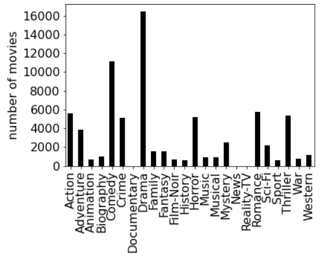
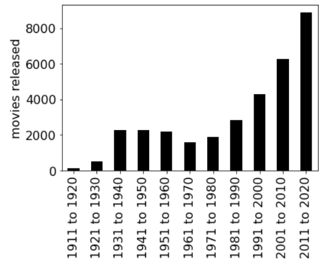
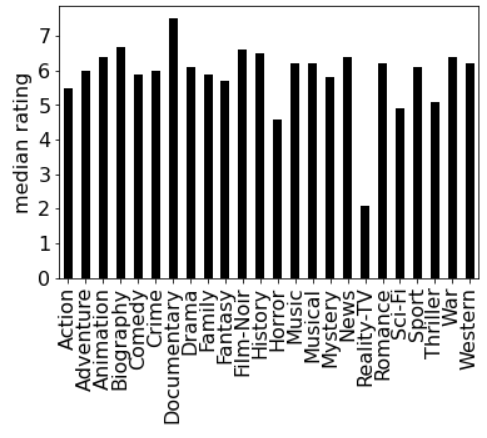

# Project 9: Analyzing the Movies

## Clarifications/Corrections

None yet.

**Find any issues?** Report to us:  

- Chaitanya Kabra [ckabra@wisc.edu](mailto:ckabra@wisc.edu)
- Raj Aryan Singh [rsingh94@wisc.edu](mailto:rsingh94@wisc.edu)

## Learning Objectives

In this project, you will demonstrate your ability to:
- Use matplotlib to plot bar graphs and visualize statistics
- Process data using dictionaries and lists that you build
- Implement binning by writing algorithms that create dictionaries 
- Custom sort a list using the keyword argument 'key='

## Coding Style Requirements

Remember that coding style matters! **We will deduct points for bad coding style.** Please refer to [requirements in p8](https://github.com/msyamkumar/cs220-f21-projects/tree/main/p8#coding-style-requirements). 

**Allowed**: You are allowed to use comprehensions, since we covered them in the Nov 03 lecture. 

**Warning**: Please do not use the method `csv.DictReader` for p9. Although the required output can be obtained using this method, one of the learning outcomes of this project is to demonstrate your ability to build dictionaries with your own code.

**Warning**: Although you will need to import `numpy` and `pandas` to make plots, you may not use these modules for any other purposes.  Instead, you will build custom lists and dictionaries through algorithms, and sort them using the skills you learned in lecture and in lab-p9.

## Introduction

In p8, you created very useful helper functions to help parse the raw movie IMDb dataset. In this project, we will be using the work you
did in p8 to load the movie data and analyze the data.

**Warning**: For the questions asking you to plot, our `test.py` is unable to check whether your plot is correct. As long as you have any output for these questions, you will pass the tests. So make sure you **manually compare** your plots with the expected plots before submitting your notebook.

As usual, hand in the `main.ipynb` file (use the `#qN` format).  Start by downloading the following files: [`test.py`](https://github.com/msyamkumar/cs220-f21-projects/blob/main/p9/test.py), [`mapping.csv`](https://github.com/msyamkumar/cs220-f21-projects/blob/main/p8/mapping.csv), and [`movies.csv`](https://github.com/msyamkumar/cs220-f21-projects/blob/main/p8/movies.csv). Note that we are using the same `mapping.csv` and the same `movies.csv` as we did in [p8](https://github.com/msyamkumar/cs220-f21-projects/tree/main/p8). 

In `main.ipynb`, make sure to include a new cell with the following code:

```python
import csv
import copy 
import matplotlib
import pandas

# Allows you to render matplotlib graphs in the same notebook
%matplotlib inline 

def plot_dict(d, label="Please Label Me!!!"):
    ax = pandas.Series(d).sort_index().plot.bar(color="black", fontsize=16)
    ax.set_ylabel(label, fontsize=16)
```

[**lab-p9**](https://github.com/msyamkumar/cs220-f21-projects/tree/main/lab-p9) goes over the installation and the basic usage of **matplotlib** and **pandas**. Please make sure to go over the lab before dive into the project. 

Finally, copy the functions you wrote from p8 to `main.ipynb`. As a reminder, the functions you should include are `get_mapping`, `get_raw_movies`, `get_movies`, along with any helper functions you used to write these. We recommend that you also copy the function `search_bar` over to p9, but `genre_search_bar` will not be necessary. We will be creating an improved version of that function in p9!

If you are ready, let's get started!

## Analyzing the Movie Data

For all these questions, we will be looking at the movies in `mapping.csv` and `movies.csv`. You can load the list of movies using the function
you wrote in the last project (Note you should only have to do this once):

```python
movies = get_movies("movies.csv", "mapping.csv")
```

This will result on a list of movies, which we can loop over and answer interesting questions about. The first entry in the list should be
a dictionary that looks like this:

```python
{'title': 'They Live',
 'year': 1988,
 'genres': ['Action', 'Horror', 'Sci-Fi'],
 'duration': 94,
 'directors': ['John Carpenter'],
 'actors': ['Roddy Piper', 'Keith David', 'Meg Foster'],
 'rating': 7.3}
```

**Warning:** At this stage, it is expected that the function `get_movies` works correctly, and passes all of the tests in p8. If not, your code will run into issues in p9. So, make sure that this function works properly before you start p9. Your function should order the movies in the same order as they are in `movies.csv`. For all question in this project, **unless it is explicitly mentioned otherwise**, whenever you are asked to return a list of movies, the movies should be **listed in the order in which they appear in** `movies.csv`.

---

The first few questions can be answered using functions from p8. They should help you familiarize yourself with the data
and understand how to traverse it with loops.

### #Q1: What is the average rating of the 'Lord of the Rings' trilogy, which was directed by 'Peter Jackson'?

**Hint:** You can find the list of movies from the trilogy with multiple calls to the `search_bar` function from p8. 

**Warning:** Be sure that you do not modify the original movies list. 

### #Q2: What is the median rating of all 'Mission: Impossible' movies?

**Hint:** You can once again use the `search_bar` function to find these movies. Recall that you wrote a median function in lab-p9. 

**Warning:** **DO NOT** use the numpy module to find the median. 


*What is your favorite movie series? Try to find its median rating if you can.*


### #Q3: Find all the movies with least rating.

**Note:** There are several movies tied in the dataset with the least rating. Your output should be a **list** containing all of these movies.

**Hint:** Iterate through movies, finding the minimum rating. Then iterate through movies again and find all movies that have that rating. 

**Challenge:** This is not required, but there is a way to do this with only one loop through movies. If you feel brave, attempt to find it!


### #Q4: Find the highest rated 'Toy Story' movies.

**Note:** There are several Toy Story movies tied with the highest rating. Your output should be a **list** containing all of these movies.

**Hint:** This code should be somewhat similar to your answer to Q3.

---

Now that we are acquainted with the dataset, we can start with our first new function from p9.

### Function suggestion:

In p8, we created a function `genre_search_bar` that *bucketized* the list of movies by their genre.  Take a moment to find that function, it will help you here.  Also, take a moment to look at the buckets you made in lab-p9.  

Now, we will create a function that is broader in scope. This function should take in the list of movies as well as a category (i.e. `'title'`, `'year'`, `'duration'`, `'actors'`, `'directors'`, or `'genres'`), and bucketize the list of movies by this category. Here is a code snippet you can start with:

``` python
def bucketize(movie_list, category):
    buckets = {}
    for movie in movie_list:
        category_value = ??? #TODO: Access the category value from a movie
        if type(category_value) == list:
            ???
        else:
            ??? 
    return buckets

```
**Warning:** Just like with `get_movies`, you should avoid calling `bucketize` too many times. Sometimes, you may have to bucketize a different list of movies, or bucketize the same list of movies by a different category. That is acceptable, but you **should not** call this function on the same list of movies and category, more than once. Otherwise, you will **lose points** during code review.

**Hint:** For most of the following questions, the `bucketize` function will be extremely useful. Even if it is not explicitly mentioned, you should look for places where you can use this function. It can make your job a lot easier!


### #Q5: Find the list of movies 'Chadwick Boseman' acted in.

**Note:** You should answer this using `bucketize`.

**Warning:** Remember that you are not allowed to call `bucketize` too many times. So, after calling `bucketize` here, you should store it in a variable first.


### #Q6: Find the list of movies 'Emma Stone' acted in.

**Warning:** You should **NOT** call `bucketize` once again. Use your call to `bucketize` from Q5 to answer this. You will **lose points** if you call `bucketize` here.

---

### #Q7: Find the number of movies in each genre.

**Note:** Your output should be a **dict** mapping each genre to the number of movies in that genre.

**Warning:** You should call `bucketize` here and store the result in a dictionary. You will lose points if you **do not** call `bucketize` here. 

**Hint:** You are allowed use a dictionary comprehension but it is not required. 


### #Q8: Plot the number of movies in each genre as a bar graph.

**Note:** For all plotting questions, if either the horizontal axis or vertical axis for your graphs aren't labelled, you will **lose points**.

**Warning:** `test.py` can only detect if you have a plot here, not if it is correct. So compare your plot with the plot here, and ensure that it matches, so you don't lose points during code review.

Your image should look like this:



*Some of the genres appear to have no bars in this plot. Can you figure out why that is the case?*

---

### #Q9: Find the number of movies released in each decade.

**Note:** Your output should be a **dict** mapping each decade to the number of movies in that decade.

**Hint:** You may use the function you wrote in lab-p9 to create the keys for this dictionary. 

Your output should look like this:

```python
{'1981 to 1990': 2840,
 '2011 to 2020': 8884,
 '2001 to 2010': 6271,
 '1941 to 1950': 2256,
 '1971 to 1980': 1889,
 '1951 to 1960': 2201,
 '1931 to 1940': 2256,
 '1961 to 1970': 1609,
 '1991 to 2000': 4280,
 '1911 to 1920': 120,
 '1921 to 1930': 496}
```

### #Q10: Plot the number of movies released in each decade as a bar graph.

**Note:** For all plotting questions, if either the horizontal axis or vertical axis for your graphs aren't labelled, you will **lose points**.

**Warning:** `test.py` can only detect if you have a plot here, not if it is correct. So compare your plot with the plot here, and ensure that it matches, so you don't lose points during code review.

Your image should look like this:



*Can you explain the peculiar shape of this plot? Why is the number of movies in each decade **not** steadily increasing?*

---


### #Q11: Find the highest rated movies for each genre.

**Note:** Your output should be a **dict** mapping each genre to a **list** of movies from that genre with the highest rating. Note that within each genre, there can be ties. In that case, your list should contain all movies in that genre tied with the highest rating.

For example, the key `'Sport'` should have the following value:

```python
[{'title': 'The Nomads',
  'year': 2019,
  'genres': ['Drama', 'Sport'],
  'duration': 97,
  'directors': ['Brandon Eric Kamin'],
  'actors': ['Andrea Barnes', 'Erik Blachford', 'Jennifer Butler'],
  'rating': 8.2},
 {'title': 'Raging Bull',
  'year': 1980,
  'genres': ['Biography', 'Drama', 'Sport'],
  'duration': 129,
  'directors': ['Martin Scorsese'],
  'actors': ['Robert De Niro', 'Cathy Moriarty'],
  'rating': 8.2},
 {'title': 'Warrior',
  'year': 2011,
  'genres': ['Action', 'Drama', 'Sport'],
  'duration': 140,
  'directors': ["Gavin O'Connor"],
  'actors': ['Joel Edgerton', 'Tom Hardy', 'Nick Nolte'],
  'rating': 8.2}]
```

**Hint:** This problem is similar to Q4. Now would be a great time to go back and create a function that can take in a list of movies and return a list of the movies with the maximum rating (if you don't already have such a function). You can solve this problem very efficiently using the buckets of genres that you made earlier.

---

### #Q12: Find the median rating of movies from each genre.

**Note:** Your output should be a **dict** mapping each genre to the median rating of the movies in that genre. Use the median function you wrote in lab-p9. 


### #Q13: Plot the median of movies in each genre as a bar graph.

**Note:** For all plotting questions, if either the horizontal axis or vertical axis for your graphs aren't labelled, you will **lose points**.

**Warning:** `test.py` can only detect if you have a plot here, not if it is correct. So compare your plot with the plot here, and ensure that it matches, so you don't lose points during code review.

Your image should look like this:



*Are you surprised by any of the median ratings here? Can you explain why Documentaries and Reality-TV are such outliers?*

---

The visualization in Q13 immediately tells us that Adventure movies are rated higher than Action movies. However, it is a little hard to tell how Westerns fare against Musicals. In order to compare the genres, it would be useful to *sort* the genres by their median rating.


### #Q14: Sort the list of genres in decreasing order of their median rating.

**Note:** Your output should be a list of genres **sorted in decreasing order of their median rating**.

**Hint:** In lab-p9 you practiced this. 


### #Q15: Sort all 'Star Wars' movies in increasing order of their year of release.

**Note:** Your output should be a list of Star Wars movies **sorted in increasing order of their year**.

**Hint:** In lab-p9 you practiced this.

---

### #Q16: Find a list of all movies that are both acted and directed by 'Clint Eastwood'.

**Hint:** You may have found the `search_bar` function useful for some of the earlier questions, but it will not be of much use here. However, if you make clever calls to some of the functions we have already defined, you can solve this with a single line of code! Of course, you may solve this any way you prefer.


### #Q17: Sort the titles of the movies that are both acted and directed by 'Clint Eastwood'.

**Note:** Your output should be a list of movie titles **sorted in increasing order of their duration**.


### #Q18: Sort the titles of the movies that are directed by both 'Anthony Russo' and 'Joe Russo' in increasing order of their durations.

**Note:** Your output should be a list of the movie titles **sorted in increasing order of their duration**.


### #Q19: Find the titles of the 15 shortest Biographies in the dataset.

**Note:** Your output should be a list of movie titles **sorted in increasing order of their duration**.

**Hint:** If you find that the movie `'Dillinger'` is missing from your output, it is likely because you are not sorting the proper data structure. Review lab-p9.

---

Finally, let us end this project with a more challenging question. Let us try to find the *best* actors in the dataset. The natural solution would be to find the actors with the highest *median* rating across their movies. However, this approach does not quite work. This is because actors who have acted in very few movies are massively boosted by this metric. For instance, the actors with the highest median rating in this dataset are Walter Nudo, Colin Ross and Ian Poland, who have all acted in a single (highly rated) movie in the dataset.

```python
[{'title': 'Hopeful Notes',
  'year': 2010,
  'genres': ['Drama'],
  'duration': 94,
  'directors': ['Valerio Zanoli'],
  'actors': ['Walter Nudo', 'Colin Ross', 'Ian Poland'],
  'rating': 9.7}]
```

So, if we truly wanted to find the best actors, it would make sense to limit ourselves to those actors who have acted in a fair number of movies.


### #Q20: Find the top 25 actors with the highest median rating among those actors who have acted in at least 15 movies.

**Note:** Your output should be a list of actors **sorted in decreasing order of their median rating**.

*Does this list seem reasonable? Can you think of a better way to determine who the actors are?*

---

### Before turning in:
Be sure to run test.py and make sure there are no errors. If you turn in a version of your code which fails on test.py (i.e. you can't see which questions you got right or not), **we will deduct 5 points**. If the autograder is failing but you still want to turn in, you can see which question it is failing on and comment out the code for that question, essentially leaving it out. 

After you add your name and the name of your partner to the notebook, please remember to **Kernel->Restart and Run All** to check for errors then run the test.py script one more time before submission.  To keep your code concise, please **remove your own testing code that does not influence the correctness of answers.**

That is it for p9! Hope you had fun with the movies dataset! Please let us know if you find anything cool about your favorite movies from this dataset!


